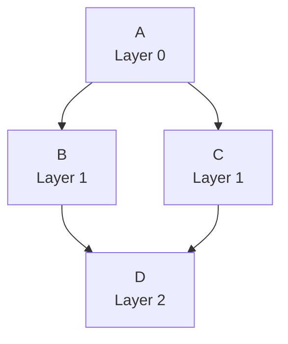

# P4-2: 拓扑排序引擎设计稿

## 1. 文档目标

本文档详细设计DAG拓扑排序引擎，在工作流定义基础上实现任务的执行顺序计算，解决以下问题：

- 如何确定任务的执行顺序
- 如何识别可并行执行的任务
- 如何处理多个入口节点的DAG
- 如何优化执行效率

**核心价值**：将工作流DAG转换为可执行的任务层级结构，是工作流引擎的"调度器"。

---

## 2. 拓扑排序核心概念

### 2.1 什么是拓扑排序

**定义**：对有向无环图（DAG）的所有节点进行线性排序，使得对于任意有向边 u → v，u 在排序中都出现在 v 之前。

**示例**：
```
DAG:
    A → B → D
    A → C → D

拓扑排序结果（多个可能）：
- 方案1: A → B → C → D
- 方案2: A → C → B → D
```

**关键特性**：
- ✅ 拓扑排序的结果不唯一
- ✅ 只有DAG才能进行拓扑排序
- ✅ 拓扑排序可以识别可并行执行的节点

### 2.2 为什么需要拓扑排序

**场景1：确定任务执行顺序**
```
数据处理工作流：
提取数据(A) → 清洗数据(B) → 生成报表(D)
            ↘ 转换数据(C) ↗

必须先执行A，再执行B和C，最后执行D
```

**场景2：识别并行机会**
```
任务B和C不依赖彼此 → 可以并行执行
→ 大幅缩短工作流总执行时间
```

**场景3：资源优化**
```
分层执行：
- 第0层：[A]         → 需要1个资源
- 第1层：[B, C]      → 需要2个资源（并行）
- 第2层：[D]         → 需要1个资源

提前知道每层的资源需求，优化资源分配
```

---

## 3. 拓扑排序算法

### 3.1 算法选择：Kahn算法

**为什么选择Kahn算法？**

| 算法 | 时间复杂度 | 空间复杂度 | 优点 | 缺点 |
|-----|----------|-----------|------|------|
| DFS | O(V+E) | O(V) | 实现简单 | 不易识别并行层 |
| Kahn | O(V+E) | O(V) | 易于分层，直观 | 需要维护入度表 |

**结论**：选择Kahn算法，因为它天然支持分层（识别并行任务）。

### 3.2 Kahn算法原理

**核心思想**：不断移除入度为0的节点（无前置依赖的节点）。

**步骤**：
1. 计算所有节点的入度（入度 = 有多少条边指向该节点）
2. 将入度为0的节点加入队列
3. 循环：
   - 从队列取出一个节点，加入结果
   - 将该节点的所有邻居的入度-1
   - 如果邻居入度变为0，加入队列
4. 如果最终所有节点都被访问，则拓扑排序成功；否则存在环

**动画演示**：
```
初始状态:
    A(入度0) → B(入度1) → D(入度2)
    A(入度0) → C(入度1) → D(入度2)

第1轮:
  队列: [A]
  取出A，加入结果: [A]
  B入度: 1→0, C入度: 1→0
  队列: [B, C]

第2轮:
  取出B，加入结果: [A, B]
  D入度: 2→1
  队列: [C]

第3轮:
  取出C，加入结果: [A, B, C]
  D入度: 1→0
  队列: [D]

第4轮:
  取出D，加入结果: [A, B, C, D]
  队列: []

完成！拓扑排序: [A, B, C, D]
```

### 3.3 分层拓扑排序

**关键改进**：同时处理一层的所有入度为0的节点。

**目标**：
```
标准拓扑排序: [A, B, C, D]
分层拓扑排序: [[A], [B, C], [D]]
              第0层  第1层   第2层

第1层的B和C可以并行执行！
```

**算法实现**：
```java
public class TopologicalSorter {
    
    /**
     * 分层拓扑排序（Kahn算法）
     * 
     * @param graph 邻接表表示的DAG
     * @return 分层结构，每层的任务可并行执行
     */
    public List<List<String>> layeredTopologicalSort(Map<String, List<String>> graph) {
        
        // 1. 计算入度
        Map<String, Integer> inDegree = new HashMap<>();
        for (String node : graph.keySet()) {
            inDegree.putIfAbsent(node, 0);
            for (String neighbor : graph.get(node)) {
                inDegree.put(neighbor, inDegree.getOrDefault(neighbor, 0) + 1);
            }
        }
        
        // 2. 初始化队列（入度为0的节点）
        Queue<String> queue = new LinkedList<>();
        for (Map.Entry<String, Integer> entry : inDegree.entrySet()) {
            if (entry.getValue() == 0) {
                queue.offer(entry.getKey());
            }
        }
        
        // 3. 分层处理
        List<List<String>> layers = new ArrayList<>();
        Set<String> visited = new HashSet<>();
        
        while (!queue.isEmpty()) {
            // 当前层的所有节点
            int layerSize = queue.size();
            List<String> currentLayer = new ArrayList<>();
            
            for (int i = 0; i < layerSize; i++) {
                String node = queue.poll();
                currentLayer.add(node);
                visited.add(node);
                
                // 更新邻居的入度
                for (String neighbor : graph.getOrDefault(node, Collections.emptyList())) {
                    inDegree.put(neighbor, inDegree.get(neighbor) - 1);
                    
                    // 入度变为0，加入队列（下一层）
                    if (inDegree.get(neighbor) == 0) {
                        queue.offer(neighbor);
                    }
                }
            }
            
            layers.add(currentLayer);
        }
        
        // 4. 检查是否所有节点都被访问（检测环）
        if (visited.size() != graph.size()) {
            throw new IllegalStateException("DAG存在环，无法进行拓扑排序");
        }
        
        return layers;
    }
}
```

---

## 4. 核心实现

### 4.1 Service实现

```java
@Service
@Slf4j
public class WorkflowExecutionService {
    
    @Autowired
    private WorkflowMapper workflowMapper;
    
    @Autowired
    private WorkflowService workflowService;
    
    /**
     * 计算工作流的执行计划（分层任务）
     */
    public WorkflowExecutionPlan buildExecutionPlan(Long workflowId) {
        // 1. 获取工作流定义
        Workflow workflow = workflowMapper.selectById(workflowId);
        if (workflow == null) {
            throw new IllegalArgumentException("工作流不存在: " + workflowId);
        }
        
        // 2. 解析DAG
        WorkflowDAG dag = workflowService.parseDAG(workflow.getDagJson());
        
        // 3. 构建邻接表
        Map<String, List<String>> graph = buildGraph(dag);
        Map<String, WorkflowTask> taskMap = buildTaskMap(dag);
        
        // 4. 拓扑排序（分层）
        List<List<String>> layers = topologicalSort(graph);
        
        // 5. 构建执行计划
        WorkflowExecutionPlan plan = new WorkflowExecutionPlan();
        plan.setWorkflowId(workflowId);
        plan.setWorkflowName(workflow.getName());
        plan.setTotalLayers(layers.size());
        
        List<TaskLayer> taskLayers = new ArrayList<>();
        for (int i = 0; i < layers.size(); i++) {
            TaskLayer layer = new TaskLayer();
            layer.setLayerIndex(i);
            
            List<TaskExecutionNode> nodes = new ArrayList<>();
            for (String taskName : layers.get(i)) {
                WorkflowTask task = taskMap.get(taskName);
                TaskExecutionNode node = new TaskExecutionNode();
                node.setTaskName(taskName);
                node.setTaskDefinition(task);
                node.setLayerIndex(i);
                nodes.add(node);
            }
            
            layer.setTasks(nodes);
            layer.setParallelism(nodes.size());
            taskLayers.add(layer);
        }
        
        plan.setLayers(taskLayers);
        
        log.info("构建执行计划完成 workflowId={} totalLayers={} totalTasks={}", 
                workflowId, layers.size(), taskMap.size());
        
        return plan;
    }
    
    /**
     * 构建邻接表
     */
    private Map<String, List<String>> buildGraph(WorkflowDAG dag) {
        Map<String, List<String>> graph = new HashMap<>();
        
        // 初始化所有节点
        for (WorkflowTask task : dag.getTasks()) {
            graph.put(task.getName(), new ArrayList<>());
        }
        
        // 添加边
        for (WorkflowDependency dep : dag.getDependencies()) {
            graph.get(dep.getFrom()).add(dep.getTo());
        }
        
        return graph;
    }
    
    /**
     * 构建任务映射表
     */
    private Map<String, WorkflowTask> buildTaskMap(WorkflowDAG dag) {
        Map<String, WorkflowTask> taskMap = new HashMap<>();
        for (WorkflowTask task : dag.getTasks()) {
            taskMap.put(task.getName(), task);
        }
        return taskMap;
    }
    
    /**
     * 分层拓扑排序
     */
    private List<List<String>> topologicalSort(Map<String, List<String>> graph) {
        // 1. 计算入度
        Map<String, Integer> inDegree = new HashMap<>();
        for (String node : graph.keySet()) {
            inDegree.putIfAbsent(node, 0);
        }
        for (String node : graph.keySet()) {
            for (String neighbor : graph.get(node)) {
                inDegree.put(neighbor, inDegree.getOrDefault(neighbor, 0) + 1);
            }
        }
        
        // 2. 初始化队列
        Queue<String> queue = new LinkedList<>();
        for (Map.Entry<String, Integer> entry : inDegree.entrySet()) {
            if (entry.getValue() == 0) {
                queue.offer(entry.getKey());
            }
        }
        
        // 3. 分层处理
        List<List<String>> layers = new ArrayList<>();
        Set<String> visited = new HashSet<>();
        
        while (!queue.isEmpty()) {
            int layerSize = queue.size();
            List<String> currentLayer = new ArrayList<>();
            
            for (int i = 0; i < layerSize; i++) {
                String node = queue.poll();
                currentLayer.add(node);
                visited.add(node);
                
                for (String neighbor : graph.getOrDefault(node, Collections.emptyList())) {
                    inDegree.put(neighbor, inDegree.get(neighbor) - 1);
                    if (inDegree.get(neighbor) == 0) {
                        queue.offer(neighbor);
                    }
                }
            }
            
            layers.add(currentLayer);
        }
        
        // 4. 检测环
        if (visited.size() != graph.size()) {
            log.error("检测到环，已访问节点数={} 总节点数={}", visited.size(), graph.size());
            throw new IllegalStateException("DAG存在环，无法进行拓扑排序");
        }
        
        log.info("拓扑排序完成 layers={}", layers);
        return layers;
    }
}
```

### 4.2 数据模型

```java
/**
 * 工作流执行计划
 */
@Data
public class WorkflowExecutionPlan {
    private Long workflowId;
    private String workflowName;
    private Integer totalLayers;              // 总层数
    private List<TaskLayer> layers;           // 任务层列表
    
    /**
     * 获取总任务数
     */
    public int getTotalTaskCount() {
        return layers.stream()
                .mapToInt(layer -> layer.getTasks().size())
                .sum();
    }
    
    /**
     * 获取最大并行度
     */
    public int getMaxParallelism() {
        return layers.stream()
                .mapToInt(TaskLayer::getParallelism)
                .max()
                .orElse(0);
    }
}

/**
 * 任务层（可并行执行的任务集合）
 */
@Data
public class TaskLayer {
    private Integer layerIndex;               // 层级索引（从0开始）
    private List<TaskExecutionNode> tasks;    // 该层的任务列表
    private Integer parallelism;              // 并行度（任务数量）
    
    /**
     * 计算该层的资源需求
     */
    public ResourceRequirement calculateResourceRequirement() {
        int totalCpu = tasks.stream()
                .map(TaskExecutionNode::getTaskDefinition)
                .map(WorkflowTask::getResourceRequirement)
                .mapToInt(req -> req.getCpu() != null ? req.getCpu() : 0)
                .sum();
        
        int totalMemory = tasks.stream()
                .map(TaskExecutionNode::getTaskDefinition)
                .map(WorkflowTask::getResourceRequirement)
                .mapToInt(req -> req.getMemory() != null ? req.getMemory() : 0)
                .sum();
        
        ResourceRequirement requirement = new ResourceRequirement();
        requirement.setCpu(totalCpu);
        requirement.setMemory(totalMemory);
        return requirement;
    }
}

/**
 * 任务执行节点
 */
@Data
public class TaskExecutionNode {
    private String taskName;                  // 任务名称
    private WorkflowTask taskDefinition;      // 任务定义
    private Integer layerIndex;               // 所属层级
    private TaskNodeStatus status;            // 执行状态
    private LocalDateTime startTime;          // 开始时间
    private LocalDateTime endTime;            // 结束时间
    private String errorMessage;              // 错误信息
}

/**
 * 任务节点状态
 */
public enum TaskNodeStatus {
    PENDING,        // 等待执行
    RUNNING,        // 执行中
    SUCCESS,        // 执行成功
    FAILED,         // 执行失败
    SKIPPED         // 跳过（条件不满足）
}
```

### 4.3 API设计

```java
@RestController
@RequestMapping("/api/workflow/execution")
@Slf4j
public class WorkflowExecutionController {
    
    @Autowired
    private WorkflowExecutionService executionService;
    
    /**
     * 获取工作流执行计划（预览）
     */
    @GetMapping("/plan/{workflowId}")
    public Result<WorkflowExecutionPlan> getExecutionPlan(@PathVariable Long workflowId) {
        log.info("获取执行计划 workflowId={}", workflowId);
        
        WorkflowExecutionPlan plan = executionService.buildExecutionPlan(workflowId);
        return Result.success(plan);
    }
    
    /**
     * 分析工作流并行度
     */
    @GetMapping("/analysis/{workflowId}")
    public Result<WorkflowAnalysis> analyzeWorkflow(@PathVariable Long workflowId) {
        WorkflowExecutionPlan plan = executionService.buildExecutionPlan(workflowId);
        
        WorkflowAnalysis analysis = new WorkflowAnalysis();
        analysis.setTotalTasks(plan.getTotalTaskCount());
        analysis.setTotalLayers(plan.getTotalLayers());
        analysis.setMaxParallelism(plan.getMaxParallelism());
        
        // 计算理论最短执行时间（假设每个任务执行1分钟）
        analysis.setMinExecutionMinutes(plan.getTotalLayers());
        
        // 计算串行执行时间（假设每个任务执行1分钟）
        analysis.setSerialExecutionMinutes(plan.getTotalTaskCount());
        
        // 计算并行化收益
        double speedup = (double) plan.getTotalTaskCount() / plan.getTotalLayers();
        analysis.setSpeedup(speedup);
        
        return Result.success(analysis);
    }
}
```

---

## 5. 执行计划示例

### 5.1 简单DAG

**输入**：
```json
{
  "tasks": [
    {"name": "A", "type": "shell", "command": "echo A"},
    {"name": "B", "type": "shell", "command": "echo B"},
    {"name": "C", "type": "shell", "command": "echo C"}
  ],
  "dependencies": [
    {"from": "A", "to": "B"},
    {"from": "B", "to": "C"}
  ]
}
```

**执行计划**：
```json
{
  "workflowId": 1,
  "workflowName": "简单流水线",
  "totalLayers": 3,
  "layers": [
    {
      "layerIndex": 0,
      "tasks": [{"taskName": "A"}],
      "parallelism": 1
    },
    {
      "layerIndex": 1,
      "tasks": [{"taskName": "B"}],
      "parallelism": 1
    },
    {
      "layerIndex": 2,
      "tasks": [{"taskName": "C"}],
      "parallelism": 1
    }
  ]
}
```

**分析**：
- 总任务数：3
- 最大并行度：1
- 无并行化机会

### 5.2 复杂DAG（含并行）

**输入**：
```json
{
  "tasks": [
    {"name": "A", "type": "shell", "command": "echo A"},
    {"name": "B", "type": "shell", "command": "echo B"},
    {"name": "C", "type": "shell", "command": "echo C"},
    {"name": "D", "type": "shell", "command": "echo D"},
    {"name": "E", "type": "shell", "command": "echo E"}
  ],
  "dependencies": [
    {"from": "A", "to": "B"},
    {"from": "A", "to": "C"},
    {"from": "B", "to": "D"},
    {"from": "C", "to": "D"},
    {"from": "D", "to": "E"}
  ]
}
```

**可视化**：
```
        A
       / \
      B   C
       \ /
        D
        |
        E
```

**执行计划**：
```json
{
  "workflowId": 2,
  "workflowName": "并行ETL流程",
  "totalLayers": 4,
  "layers": [
    {
      "layerIndex": 0,
      "tasks": [{"taskName": "A"}],
      "parallelism": 1
    },
    {
      "layerIndex": 1,
      "tasks": [
        {"taskName": "B"},
        {"taskName": "C"}
      ],
      "parallelism": 2
    },
    {
      "layerIndex": 2,
      "tasks": [{"taskName": "D"}],
      "parallelism": 1
    },
    {
      "layerIndex": 3,
      "tasks": [{"taskName": "E"}],
      "parallelism": 1
    }
  ]
}
```

**分析**：
- 总任务数：5
- 总层数：4
- 最大并行度：2（第1层）
- 加速比：5 / 4 = 1.25x

**并行执行时间线**：
```
时刻    Layer 0    Layer 1    Layer 2    Layer 3
---------------------------------------------
T0-T1     A
T1-T2              B, C
T2-T3                         D
T3-T4                                    E

总时间：4个时间单位
串行时间：5个时间单位
节省：20%
```

### 5.3 多入口DAG

**输入**：
```json
{
  "tasks": [
    {"name": "A", "type": "shell", "command": "echo A"},
    {"name": "B", "type": "shell", "command": "echo B"},
    {"name": "C", "type": "shell", "command": "echo C"}
  ],
  "dependencies": [
    {"from": "A", "to": "C"},
    {"from": "B", "to": "C"}
  ]
}
```

**可视化**：
```
A   B  (两个入口)
 \ /
  C
```

**执行计划**：
```json
{
  "layers": [
    {
      "layerIndex": 0,
      "tasks": [
        {"taskName": "A"},
        {"taskName": "B"}
      ],
      "parallelism": 2
    },
    {
      "layerIndex": 1,
      "tasks": [{"taskName": "C"}],
      "parallelism": 1
    }
  ]
}
```

**说明**：A和B没有依赖关系，可以并行执行。

---

## 6. 性能优化

### 6.1 缓存执行计划

```java
@Service
public class WorkflowExecutionService {
    
    private final Cache<Long, WorkflowExecutionPlan> planCache = 
        CacheBuilder.newBuilder()
            .maximumSize(500)
            .expireAfterWrite(30, TimeUnit.MINUTES)
            .build();
    
    public WorkflowExecutionPlan buildExecutionPlan(Long workflowId) {
        try {
            return planCache.get(workflowId, () -> {
                log.info("缓存未命中，重新构建执行计划 workflowId={}", workflowId);
                return douildExecutionPlan(workflowId);
            });
        } catch (ExecutionException e) {
            throw new RuntimeException("构建执行计划失败", e);
        }
    }
    
    /**
     * 工作流更新时清除缓存
     */
    public void invalidatePlanCache(Long workflowId) {
        planCache.invalidate(workflowId);
        log.info("清除执行计划缓存 workflowId={}", workflowId);
    }
}
```

### 6.2 算法复杂度分析

| 操作 | 时间复杂度 | 说明 |
|-----|----------|------|
| 构建邻接表 | O(V + E) | V=任务数，E=依赖数 |
| 计算入度 | O(V + E) | 遍历所有边 |
| 拓扑排序 | O(V + E) | 每个节点和边访问一次 |
| 总复杂度 | O(V + E) | 线性复杂度 |

**实际性能**：
- 100个任务，200个依赖 → <10ms
- 1000个任务，2000个依赖 → <100ms

---

## 7. 测试方案

### 7.1 单元测试

```java
@SpringBootTest
public class TopologicalSortTest {
    
    @Autowired
    private WorkflowExecutionService executionService;
    
    @Test
    public void testLinearDAG() {
        // A → B → C
        Map<String, List<String>> graph = Map.of(
            "A", List.of("B"),
            "B", List.of("C"),
            "C", List.of()
        );
        
        List<List<String>> layers = executionService.topologicalSort(graph);
        
        assertEquals(3, layers.size());
        assertEquals(List.of("A"), layers.get(0));
        assertEquals(List.of("B"), layers.get(1));
        assertEquals(List.of("C"), layers.get(2));
    }
    
    @Test
    public void testParallelDAG() {
        // A → B, A → C, B → D, C → D
        Map<String, List<String>> graph = Map.of(
            "A", List.of("B", "C"),
            "B", List.of("D"),
            "C", List.of("D"),
            "D", List.of()
        );
        
        List<List<String>> layers = executionService.topologicalSort(graph);
        
        assertEquals(3, layers.size());
        assertEquals(List.of("A"), layers.get(0));
        assertEquals(2, layers.get(1).size()); // B和C并行
        assertTrue(layers.get(1).contains("B"));
        assertTrue(layers.get(1).contains("C"));
        assertEquals(List.of("D"), layers.get(2));
    }
    
    @Test
    public void testMultipleEntries() {
        // A → C, B → C
        Map<String, List<String>> graph = Map.of(
            "A", List.of("C"),
            "B", List.of("C"),
            "C", List.of()
        );
        
        List<List<String>> layers = executionService.topologicalSort(graph);
        
        assertEquals(2, layers.size());
        assertEquals(2, layers.get(0).size()); // A和B并行
        assertEquals(List.of("C"), layers.get(1));
    }
    
    @Test
    public void testCyclicGraph() {
        // A → B → C → A (环)
        Map<String, List<String>> graph = Map.of(
            "A", List.of("B"),
            "B", List.of("C"),
            "C", List.of("A")
        );
        
        assertThrows(IllegalStateException.class, 
            () -> executionService.topologicalSort(graph));
    }
}
```

### 7.2 集成测试

```java
@SpringBootTest
public class WorkflowExecutionPlanTest {
    
    @Autowired
    private WorkflowExecutionService executionService;
    
    @Autowired
    private WorkflowMapper workflowMapper;
    
    @Test
    public void testBuildExecutionPlan() {
        // 创建测试工作流
        Workflow workflow = new Workflow();
        workflow.setName("测试工作流");
        workflow.setProjectId(1L);
        workflow.setDagJson("""
            {
              "tasks": [
                {"name": "A", "type": "shell", "command": "echo A"},
                {"name": "B", "type": "shell", "command": "echo B"},
                {"name": "C", "type": "shell", "command": "echo C"}
              ],
              "dependencies": [
                {"from": "A", "to": "B"},
                {"from": "A", "to": "C"}
              ]
            }
            """);
        workflowMapper.insert(workflow);
        
        // 构建执行计划
        WorkflowExecutionPlan plan = executionService.buildExecutionPlan(workflow.getId());
        
        assertNotNull(plan);
        assertEquals(2, plan.getTotalLayers());
        assertEquals(3, plan.getTotalTaskCount());
        assertEquals(2, plan.getMaxParallelism());
    }
}
```

---

## 8. 监控与分析

### 8.1 执行计划可视化

```java
@Service
public class WorkflowVisualizationService {
    
    /**
     * 生成Mermaid图
     */
    public String generateMermaidDiagram(WorkflowExecutionPlan plan) {
        StringBuilder sb = new StringBuilder();
        sb.append("graph TD\n");
        
        for (TaskLayer layer : plan.getLayers()) {
            for (TaskExecutionNode node : layer.getTasks()) {
                sb.append("    ").append(node.getTaskName())
                  .append("[\"").append(node.getTaskName())
                  .append("\\nLayer ").append(layer.getLayerIndex())
                  .append("\"]\n");
            }
        }
        
        // 添加依赖关系（需要从原始DAG获取）
        // ...
        
        return sb.toString();
    }
}
```

**示例输出**：


### 8.2 并行度分析

```java
@Service
public class WorkflowAnalysisService {
    
    public ParallelismReport analyzeParallelism(WorkflowExecutionPlan plan) {
        ParallelismReport report = new ParallelismReport();
        
        int totalTasks = plan.getTotalTaskCount();
        int totalLayers = plan.getTotalLayers();
        
        // 平均并行度
        double avgParallelism = (double) totalTasks / totalLayers;
        report.setAverageParallelism(avgParallelism);
        
        // 并行化比率
        int parallelTasks = 0;
        for (TaskLayer layer : plan.getLayers()) {
            if (layer.getParallelism() > 1) {
                parallelTasks += layer.getParallelism();
            }
        }
        double parallelRatio = (double) parallelTasks / totalTasks;
        report.setParallelRatio(parallelRatio);
        
        // 关键路径长度
        report.setCriticalPathLength(totalLayers);
        
        return report;
    }
}
```

---

## 9. 常见问题

### Q1: 拓扑排序结果是否唯一？

**答**：不唯一。对于同一层的任务，顺序可以任意调整。
```
例如：第1层 [B, C] 和 [C, B] 都是合法的
```

### Q2: 如何处理没有依赖关系的独立任务？

**答**：它们都会被放在第0层，可以并行执行。
```
A, B, C都无依赖 → 第0层: [A, B, C]
```

### Q3: 拓扑排序能否检测环？

**答**：可以。如果最终访问的节点数 < 总节点数，说明存在环。

### Q4: 如何优化大规模DAG的拓扑排序性能？

**答**：
1. 缓存执行计划（工作流定义不常变）
2. 异步构建执行计划
3. 分布式拓扑排序（超大规模DAG，少见）

---

## 10. 后续优化方向

### 10.1 P4-3: 工作流实例执行
- 基于执行计划实例化工作流
- 按层并行调度任务
- 实时跟踪执行状态

### 10.2 关键路径分析
```java
// 计算关键路径（最长路径）
public List<String> findCriticalPath(WorkflowExecutionPlan plan) {
    // 动态规划计算每个节点到终点的最长路径
    // ...
}
```

### 10.3 资源感知调度
```java
// 根据资源可用性动态调整并行度
public void scheduleLayerWithResourceConstraint(TaskLayer layer) {
    ResourceRequirement required = layer.calculateResourceRequirement();
    ResourceRequirement available = resourceService.getAvailableResource();
    
    if (available.canSatisfy(required)) {
        // 全部并行执行
    } else {
        // 分批执行
    }
}
```

---

## 11. 总结

拓扑排序引擎是工作流执行的核心，价值：

✅ **执行顺序**：确定任务的合法执行顺序  
✅ **并行识别**：自动识别可并行执行的任务  
✅ **性能优化**：最大化并行度，缩短总执行时间  
✅ **安全性**：检测环，确保DAG合法性  

**关键设计决策**：
- 使用Kahn算法（O(V+E)时间复杂度）
- 分层结构（每层任务可并行）
- 缓存执行计划（避免重复计算）
- 可视化分析（帮助用户优化工作流）

**实际效果**：
- 简单流水线：无并行化收益
- 复杂DAG：1.2x - 3x加速比
- 大规模DAG（50+任务）：可达5x+加速比

这个设计为后续的工作流实例执行和并行调度奠定了坚实基础。🚀
