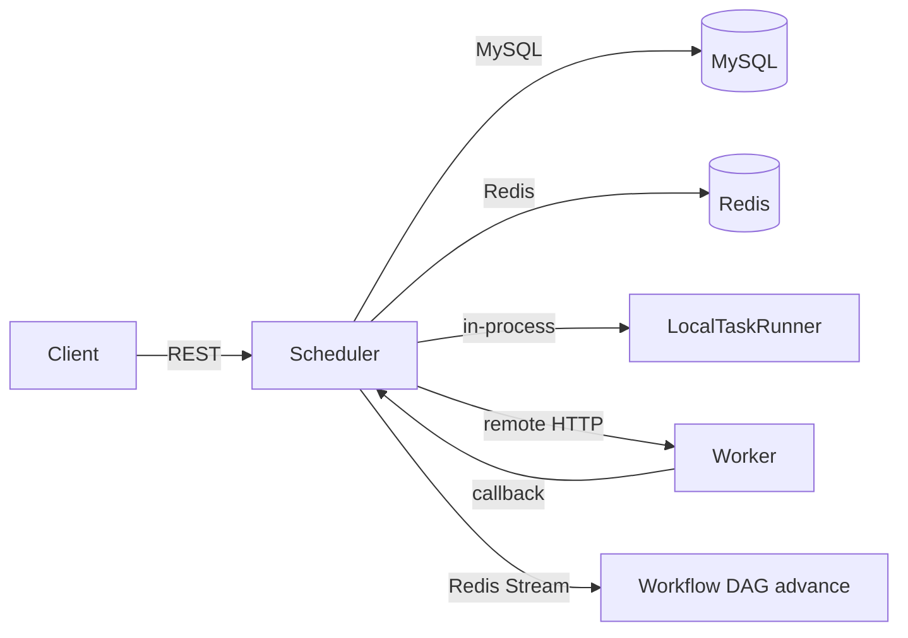

# Distributed Lite Scheduler V1 — Project Overview

A Maven multi-module **Spring Boot 4.0.5 / Java 21** distributed task scheduler with a control-plane (`scheduler`) and optional remote execution agents (`worker`). Persistence is **MySQL + MyBatis-Plus**; coordination uses **Redis + Redisson** (leader election, per-task locks, workflow completion streams).

---

## 1. Module Structure

| Module | Artifact | Path | Role |
|--------|----------|------|------|
| **Parent** | `distributed-lite-scheduler-parent` | `d:\A\1 IDEAprojects_rep\Distributed Lite Scheduler_V1\pom.xml` | Aggregates `scheduler` + `worker`; defines Java 21, JJWT 0.12.6, Redisson 4.0.0 |
| **Scheduler** | `Distributed_Lite_Scheduler_V1` | `d:\A\1 IDEAprojects_rep\Distributed Lite Scheduler_V1\scheduler\` | Control plane: REST API, scheduling, workflows, resource management, local or remote dispatch (~222 Java files) |
| **Worker** | `distributed-lite-worker` | `d:\A\1 IDEAprojects_rep\Distributed Lite Scheduler_V1\worker\` | Remote task executor: HTTP accept/cancel, Shell/Python/Docker, callback to scheduler (31 Java files) |
| **Docs** | — | `d:\A\1 IDEAprojects_rep\Distributed Lite Scheduler_V1\docs\` | Design docs, SQL, reliability notes (~66 files) |
| **Tools** | — | `d:\A\1 IDEAprojects_rep\Distributed Lite Scheduler_V1\tools\redis\` | Bundled Windows Redis binaries (dev convenience, untracked in git) |

**Entry points:**
- `d:\A\1 IDEAprojects_rep\Distributed Lite Scheduler_V1\scheduler\src\main\java\com\imperium\distributed_lite_scheduler_v1\DistributedLiteSchedulerV1Application.java`
- `d:\A\1 IDEAprojects_rep\Distributed Lite Scheduler_V1\worker\src\main\java\com\imperium\distributed_lite_worker\DistributedLiteWorkerApplication.java`

**High-level flow:**

---

## 2. Key Classes by Module

### 2.1 Scheduler — `service/scheduler/`

| Class | Path | Purpose |
|-------|------|---------|
| `SchedulerService` | `...\service\scheduler\SchedulerService.java` | Scheduler interface |
| `AbstractSchedulerService` | `...\service\scheduler\AbstractSchedulerService.java` | Shared quota check, reserve, dispatch, rollback |
| `FifoSchedulerServiceImpl` | `...\service\scheduler\impl\FifoSchedulerServiceImpl.java` | FIFO + first ONLINE node (`scheduler.strategy=fifo`) |
| `PrioritySchedulerServiceImpl` | `...\service\scheduler\impl\PrioritySchedulerServiceImpl.java` | Priority + aging (`strategy=priority`) |
| `ResourceAwareSchedulerServiceImpl` | `...\service\scheduler\impl\ResourceAwareSchedulerServiceImpl.java` | Best-fit node selection (default `resource-aware`) |
| `SchedulerLoopRunner` | `...\service\scheduler\SchedulerLoopRunner.java` | Single `@Scheduled` loop; leader-gated |
| `SchedulerLeaderElection` | `...\service\scheduler\SchedulerLeaderElection.java` | Redisson leader lock (Watchdog + unlock) |
| `TaskScheduleLock` | `...\service\scheduler\TaskScheduleLock.java` | Per-task distributed lock |
| `NodeHeartbeatWatchdog` | `...\service\scheduler\NodeHeartbeatWatchdog.java` | Dead nodes → OFFLINE; zombie RUNNING tasks → FAILED + retry |
| `TaskRetryService` | `...\service\scheduler\TaskRetryService.java` | Auto-retry with new `task_instance` |
| `ReconciliationWorker` | `...\service\scheduler\ReconciliationWorker.java` | Orphan RESERVED cleanup, stuck RUNNING, stuck workflows |

### 2.2 Scheduler — `service/executor/`

| Class | Path | Purpose |
|-------|------|---------|
| `TaskDispatchService` | `...\service\executor\TaskDispatchService.java` | Dispatch interface |
| `InProcessTaskDispatchService` | `...\service\executor\InProcessTaskDispatchService.java` | Default: local thread pool (`mode=in-process`) |
| `RemoteTaskDispatchService` | `...\service\executor\RemoteTaskDispatchService.java` | HTTP POST to worker (`mode=remote`) |
| `LocalTaskRunner` | `...\service\executor\LocalTaskRunner.java` | Sync execution + **task-level heartbeat** (10s) |
| `TaskHeartbeatService` | `...\service\executor\TaskHeartbeatService.java` | Updates `task_instance.last_heartbeat_at` |
| `TaskExecutionReporter` | `...\service\executor\TaskExecutionReporter.java` | Status transitions after execution |
| `TaskInstanceTerminalHandler` | `...\service\executor\completion\TaskInstanceTerminalHandler.java` | Terminal state side effects (workflow events, retry) |
| `RunSpecBuilder` | `...\service\executor\RunSpecBuilder.java` | Builds run spec from DB |
| `WorkerHttpClient` | `...\service\executor\WorkerHttpClient.java` | Remote worker HTTP client |
| `WorkerRunRequestFactory` | `...\service\executor\WorkerRunRequestFactory.java` | Builds worker request + callback URL |
| `WorkerEndpointResolver` | `...\service\executor\WorkerEndpointResolver.java` | Resolves `resource_node.worker_endpoint` |
| `TaskTypeExecutor` + impls | `...\service\executor\TaskTypeExecutor.java`, `impl\ShellTaskTypeExecutor.java`, `impl\PythonTaskTypeExecutor.java`, `impl\DockerTaskTypeExecutor.java` | Shell / Python / Docker |
| `TaskTimeoutWatchdog` | `...\service\executor\watchdog\TaskTimeoutWatchdog.java` | Timeout scan for RUNNING tasks |
| `TaskExecutionCancelService` | `...\service\executor\TaskExecutionCancelService.java` | Cancel in-flight tasks |

### 2.3 Scheduler — `service/workflow/`

| Class | Path | Purpose |
|-------|------|---------|
| `WorkflowService` / `WorkflowServiceImpl` | `...\service\workflow\WorkflowService.java`, `impl\WorkflowServiceImpl.java` | CRUD, DAG parsing |
| `WorkflowExecutionService` / `Impl` | `...\service\workflow\WorkflowExecutionService.java`, `impl\WorkflowExecutionServiceImpl.java` | Start/pause/resume workflow instances |
| `WorkflowExecutor` / `WorkflowExecutorImpl` | `...\service\workflow\WorkflowExecutor.java`, `impl\WorkflowExecutorImpl.java` | DAG orchestration entry |
| `WorkflowLayerDispatchFacade` | `...\service\workflow\impl\WorkflowLayerDispatchFacade.java` | Layer dispatch; sets `DISPATCHED` for idempotency |
| `WorkflowInstanceService` / `Impl` | `...\service\workflow\WorkflowInstanceService.java`, `impl\WorkflowInstanceServiceImpl.java` | Instance lifecycle |
| `WorkflowControlService` / `Impl` | `...\service\workflow\WorkflowControlService.java`, `impl\WorkflowControlServiceImpl.java` | Retry failed nodes, cancel, etc. |
| `ConditionEvaluator` | `...\service\workflow\condition\ConditionEvaluator.java` | SpEL conditional branches |
| `WorkflowConditionalLayerGate` | `...\service\workflow\condition\WorkflowConditionalLayerGate.java` | Skip layers by condition |
| `TaskCompletionStreamHandler` | `...\service\workflow\stream\TaskCompletionStreamHandler.java` | Consumes completion events; idempotent DAG advance |
| `TaskCompletionEventPublisher` | `...\service\workflow\stream\TaskCompletionEventPublisher.java` | Publishes to Redis Stream |
| `DistributedWorkflowCacheManager` | `...\service\workflow\cache\DistributedWorkflowCacheManager.java` | Caffeine + Redis workflow definition cache |
| `WorkflowAnalysisService` / `Impl` | `...\service\workflow\WorkflowAnalysisService.java`, `impl\WorkflowAnalysisServiceImpl.java` | Parallelism / bottleneck analysis (simplified) |

**Deleted (per git status):** `WorkflowVisualizationService` and its impl — visualization API removed.

### 2.4 Scheduler — `config/`

| Class | Path | Purpose |
|-------|------|---------|
| `SchedulerConfig` | `...\config\SchedulerConfig.java` | Enables `SchedulerProperties` |
| `SchedulerProperties` | `...\config\properties\SchedulerProperties.java` | `strategy`, loop interval, lock keys |
| `TaskExecutorConfig` | `...\config\TaskExecutorConfig.java` | Local executor thread pool |
| `TaskExecutorProperties` | `...\config\properties\TaskExecutorProperties.java` | `mode`, worker URLs, timeouts |
| `TaskCompletionRedisStreamConfig` | `...\config\TaskCompletionRedisStreamConfig.java` | Stable consumer name, PEL recovery |
| `WorkflowExecutorConfig` | `...\config\WorkflowExecutorConfig.java` | Workflow thread pool |
| `WorkerRestClientConfig` | `...\config\WorkerRestClientConfig.java` | RestClient for workers |
| `SecurityConfig` | `...\config\SecurityConfig.java` | JWT + internal API token |
| `MybatisPlusConfig` | `...\config\MybatisPlusConfig.java` | Pagination, optimistic lock |
| `MybatisMetaObjectHandler` | `...\config\MybatisMetaObjectHandler.java` | Auto-fill `created_at` / `updated_at` |
| `JacksonConfig` | `...\config\JacksonConfig.java` | JSON serialization |
| `AsyncExecutorConfig` | `...\config\AsyncExecutorConfig.java` | Async executors |
| `OpenApiConfig` | `...\config\OpenApiConfig.java` | Swagger UI |
| `CryptoConfig` | `...\config\CryptoConfig.java` | Password hashing |

### 2.5 Scheduler — `mapper/` (14 mappers)

All under `d:\A\1 IDEAprojects_rep\Distributed Lite Scheduler_V1\scheduler\src\main\java\com\imperium\distributed_lite_scheduler_v1\mapper\`:

`TaskMapper`, `TaskInstanceMapper`, `TaskStatusChangeLogMapper`, `ProjectMapper`, `UserMapper`, `TenantMapper`, `TenantMemberMapper`, `ResourceNodeMapper`, `ResourceSlotMapper`, `ResourceUsageMapper`, `ResourceQuotaMapper`, `WorkflowMapper`, `WorkflowInstanceMapper`, `WorkflowTaskInstanceMapper`

**Entities without mappers:** `AlertRule`, `ExecutionLog`, `MetricSnapshot`, `TaskDependency` — schema/entity only, no service layer.

### 2.6 Scheduler — Other notable layers

**Controllers** (`...\controller\`): `AuthController`, `UserController`, `TenantController`, `ProjectController`, `TaskController`, `TaskSubmitController`, `TaskInstanceController` (internal worker callback at `/api/internal/task-instances`), `ResourceController`, `ResourceQuotaController`, `WorkflowController`, `WorkflowExecutionController`, `WorkflowInstanceController`, `WorkflowInstanceMonitorController`

**Core services** (`...\service\` + `impl\`): `TaskSubmitServiceImpl`, `TaskInstanceServiceImpl`, `ResourceSlotServiceImpl`, `ResourceQuotaServiceImpl`, `TaskServiceImpl`, `AuthServiceImpl`, `UserServiceImpl`, `TenantServiceImpl`, `ProjectService`

**Security** (`...\security\`): `JwtTokenProvider`, `JwtAuthenticationFilter`, `TenantAccessGuard`, etc.

**Constants:** `TaskInstanceStatus` (includes `DISPATCHED`), `NodeType`, etc. **`TaskPriority` enum deleted** — priority is an `int` on `Task` / `TaskInstance`.

---

### 2.7 Worker — All 31 classes

| Package | Files |
|---------|-------|
| **Bootstrap** | `d:\A\1 IDEAprojects_rep\Distributed Lite Scheduler_V1\worker\src\main\java\com\imperium\distributed_lite_worker\bootstrap\WorkerRegistrationRunner.java` (register on startup), `WorkerHeartbeatScheduler.java` (node heartbeat every 30s) |
| **Controller** | `...\controller\WorkerRunController.java` — `POST /api/worker/runs`, `POST /api/worker/runs/{id}/cancel` |
| **Service** | `WorkerRunService.java` (async execution, idempotent accept), `SchedulerCallbackClient.java` (POST status to scheduler), `SchedulerNodeClient.java` (register + heartbeat), `WorkerSubmitOutcome.java` |
| **Executor** | `WorkerTaskTypeExecutor.java`, `WorkerTaskTypeExecutorRegistry.java`, `ShellTaskTypeExecutor.java`, `PythonTaskTypeExecutor.java`, `DockerTaskTypeExecutor.java`, `ParameterTemplateResolver.java`, `ExecutorConfigSupport.java`, `LocalRunSpec.java`, `ExecutionResult.java` |
| **Runtime** | `ProcessExecutionHelper.java`, `RunningTaskRegistry.java`, `RunningTaskHandle.java`, `ProcessRunningTaskHandle.java`, `WorkerRunAcceptanceRegistry.java` |
| **Config** | `WorkerProperties.java`, `WorkerExecutorConfig.java`, `WorkerSecurityConfig.java`, `OpenApiConfig.java` |
| **Security** | `WorkerTokenFilter.java` — `X-Worker-Token` |
| **DTO** | `WorkerRunRequest.java`, `WorkerRunCallback.java`, `WorkerRunAcceptedResponse.java`, `TaskStatusTransitionBody.java` |
| **App** | `DistributedLiteWorkerApplication.java` |

Worker is **functionally complete** for remote execution: register → heartbeat → accept runs → execute → callback. It does **not** send task-level heartbeats to `task_instance.last_heartbeat_at` (only node-level heartbeat).

---

## 3. `application.yaml` — Key Configs

### Scheduler (`scheduler\src\main\resources\application.yaml`)

| Section | Key settings |
|---------|--------------|
| **Spring** | App name; optional `.env` import; MySQL datasource (env-overridable); Redis host/port/db; Jackson timezone `Asia/Shanghai` |
| **Server** | Port `8080` |
| **JWT** | `jwt.secret`, `jwt.expiration-ms` (24h default) |
| **Internal API** | `internal.api.token` — worker callback auth (`X-Internal-Token`) |
| **Scheduler** | `scheduler.strategy`: `fifo` \| `priority` \| `resource-aware` (default); `loop-interval-ms: 5000`; `leader-lock-key`; per-task lock prefix |
| **Task executor** | `task.executor.enabled`, `mode: in-process` (default) \| `remote`; pool sizes; `scheduler-public-base-url`; worker timeouts; timeout watchdog |
| **Profiles** | `dev` profile raises log level |
| **OpenAPI** | Swagger at `/swagger-ui.html` |

**Remote profile overlay:** `scheduler\src\main\resources\application-remote-executor.yaml` — sets `task.executor.mode: remote` and default tokens.

### Worker (`worker\src\main\resources\application.yaml`)

| Section | Key settings |
|---------|--------------|
| **Server** | Port `9090` |
| **worker.api.token** | Worker auth token |
| **worker.scheduler.base-url** | Scheduler URL for register/heartbeat/callback |
| **worker.node.*** | Name, host, port, CPU/memory/GPU, optional `worker-endpoint` |
| **worker.executor.*** | Thread pool, work dir, output limit |
| **worker.heartbeat-interval-seconds** | `30` |
| **worker.registration-enabled** | Auto-register on startup |

---

## 4. TODOs, Stubs, and Incomplete Areas

### Explicit TODO comments in code

| Location | Note |
|----------|------|
| `...\config\WorkflowExecutorConfig.java` | `TODO: 根据实际业务场景调整参数` — thread pool tuning |
| `...\service\workflow\impl\WorkflowAnalysisServiceImpl.java` | `TODO：更加完善的实现` — DP critical path, execution time estimates |
| `...\service\workflow\WorkflowAnalysisService.java` | `TODO: 需要依赖图信息` for critical path |
| `...\service\scheduler\impl\ResourceAwareSchedulerServiceImpl.java` | Node affinity / tags — comment-only placeholder |

No `UnsupportedOperationException` or empty stub methods found in production code.

### Functionally incomplete / missing

| Area | Status |
|------|--------|
| **Alerting** | `AlertRule` entity + `alertOnFailure` fields exist; **no mapper, service, or notification delivery** |
| **Execution logs / metrics** | `ExecutionLog`, `MetricSnapshot` entities; **no persistence layer** |
| **Workflow visualization** | **Deleted** (`WorkflowVisualizationService`) |
| **Remote task heartbeat** | `TaskHeartbeatService` only used by `LocalTaskRunner`; **remote worker does not update `last_heartbeat_at`** — zombie detection relies on node heartbeat + timeout watchdog |
| **Workflow analysis** | Basic layer-based analysis; not full critical-path DP |
| **Node affinity / GPU model matching** | Partially implemented; tags/affinity TODO |
| **JPA starter** | In `scheduler/pom.xml` but **no `@Entity` / `JpaRepository`** — unused dependency |
| **Test coverage** | Only **5 test files** under `scheduler/src/test` (shell executor, condition evaluator, parameter resolver, endpoint resolver, context load) |
| **Security hardening** | Shell/Python sandboxing documented in `docs\项目未来完善方向.md` as future work |
| **Workflow context JSON** | Optional migration in `scheduler\src\main\resources\sql\p4-4_optional_workflow_instance_context.sql` — commented out |
| **Outdated comments** | e.g. `WorkflowExecutorImpl` still mentions removed in-memory submit queue |

### Recently completed (reliability work)

Documented in `docs\最新的 RELIABILITY_FIXES_SUMMARY.md`:
- Sync transactional task submit (removed memory queue)
- DAG idempotency (`DISPATCHED` status, stream handler guards)
- Stable Redis Stream consumer names
- `ReconciliationWorker` for orphan resources and stuck workflows
- `NodeHeartbeatWatchdog` + `TaskRetryService`
- `DISPATCHED` added to `TaskInstanceStatus`

---

## 5. SQL Schema Files

### Under `docs/`

| File | Purpose |
|------|---------|
| `d:\A\1 IDEAprojects_rep\Distributed Lite Scheduler_V1\docs\schema.sql` | **Main DDL** — 17 tables: `user`, `tenant`, `tenant_member`, `project`, `task`, `task_instance`, `task_dependency`, `workflow`, `workflow_instance`, `resource_node`, `resource_slot`, `resource_usage`, `resource_quota`, `execution_log`, `task_status_change_log`, `alert_rule`, `metric_snapshot` |
| `d:\A\1 IDEAprojects_rep\Distributed Lite Scheduler_V1\docs\init-data.sql` | Seed users, tenants, projects, tasks, nodes |
| `d:\A\1 IDEAprojects_rep\Distributed Lite Scheduler_V1\docs\demo-setup.sql` | Quick demo task (`demo-echo`) |
| `d:\A\1 IDEAprojects_rep\Distributed Lite Scheduler_V1\docs\migration-p2-2-resource-slot.sql` | `resource_slot` + `resource_usage` if missing |
| `d:\A\1 IDEAprojects_rep\Distributed Lite Scheduler_V1\docs\P3_1_TASK_INSTANCE_FIELDS_MIGRATION.sql` | `tenant_id`, `resource_requirement`, `executor_config`, etc. on `task_instance` |
| `d:\A\1 IDEAprojects_rep\Distributed Lite Scheduler_V1\docs\migration-heartbeat-retry.sql` | `last_heartbeat_at` on `task_instance` + indexes |
| `d:\A\1 IDEAprojects_rep\Distributed Lite Scheduler_V1\docs\hotfix-views.sql` | Fixes views referencing non-existent `deleted` on instance tables |

### Under `scheduler/src/main/resources/sql/`

| File | Purpose |
|------|---------|
| `...\sql\workflow_instance.sql` | **`workflow_task_instance` table** (not in main `docs/schema.sql`) |
| `...\sql\p5_worker_endpoint.sql` | `resource_node.worker_endpoint` column |
| `...\sql\p4-4_optional_workflow_instance_context.sql` | Optional `context_json` on `workflow_instance` (commented) |

**Schema gap:** `workflow_task_instance` is required at runtime but lives in a separate SQL file from the main schema — fresh installs must run both.

---

## 6. `pom.xml` Structure and Dependencies

### Parent (`pom.xml`)
- Spring Boot **4.0.5** parent
- Modules: `scheduler`, `worker`
- Java **21**
- Property versions: JJWT `0.12.6`, Redisson `4.0.0`

### Scheduler (`scheduler\pom.xml`)

| Dependency | Use |
|------------|-----|
| `spring-boot-starter-web` | REST API |
| `spring-boot-starter-data-jpa` | **Present but unused** (MyBatis-Plus is the real ORM) |
| `spring-boot-starter-validation` | Bean validation |
| `mysql-connector-j` | MySQL driver |
| `mybatis-plus-spring-boot4-starter` 3.5.15 | ORM |
| `spring-boot-starter-security` | JWT auth |
| `spring-boot-starter-data-redis` | Redis Streams, caching |
| `redisson-spring-boot-starter` 4.0.0 | Distributed locks |
| `caffeine` 3.1.8 | Local workflow cache |
| `hutool-all` 5.8.41 | Utilities |
| `jackson-databind` 2.19.1 | JSON |
| `jjwt-api/impl/jackson` 0.12.6 | JWT |
| `springdoc-openapi-starter-webmvc-ui` 3.0.3 | OpenAPI |
| `lombok` 1.18.44 | Boilerplate reduction |
| `spring-boot-starter-test` | Tests |

### Worker (`worker\pom.xml`)

| Dependency | Use |
|------------|-----|
| `spring-boot-starter-web` | HTTP server |
| `spring-boot-starter-validation` | Request validation |
| `spring-boot-starter-security` | Token filter |
| `jackson-databind` | JSON |
| `springdoc-openapi-starter-webmvc-ui` 3.0.3 | OpenAPI |
| `lombok` | Boilerplate |
| `spring-boot-starter-test` | Tests |

Worker is intentionally lightweight — no DB, no Redis.

---

## 7. Complete vs Missing — Summary

### Substantially complete (production-viable for core paths)

- Multi-tenant task CRUD and **synchronous** task submit
- Three schedulers with **single active strategy** + **leader election**
- Resource slots, quotas, usage ledger
- In-process and **remote worker** execution (Shell/Python/Docker)
- Worker registration, node heartbeat, idempotent task accept
- Workflow DAG: layer dispatch, conditional branches (SpEL), Redis Stream event-driven advancement
- Reliability: timeout watchdog, node heartbeat watchdog, reconciliation worker, auto-retry, idempotent stream consumption
- JWT authentication, internal API for worker callbacks
- REST controllers for tasks, workflows, resources, tenants

### Gaps / risks

1. **Schema fragmentation** — `workflow_task_instance` not in main `schema.sql`
2. **Remote mode task heartbeat gap** — zombie detection weaker for remote workers
3. **Alerting / observability tables** — entities only, no implementation
4. **Workflow visualization** — removed
5. **Minimal automated tests**
6. **Unused JPA dependency**
7. **Documented future work** in `docs\项目未来完善方向.md` (shell sandboxing, failure strategies, metrics, MQ for peak shaving, etc.)

For a deeper dive into any subsystem (e.g. resource-aware scheduling algorithm, workflow state machine, or worker callback contract), say which area you want expanded.