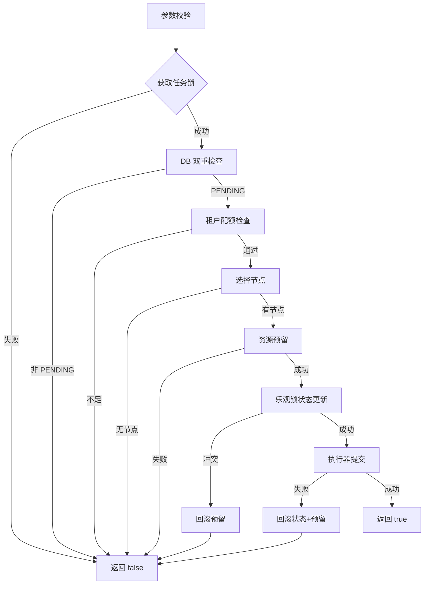

# 三种调度器深度技术解析（FIFO / 优先级 / 资源感知）

> **文档目标**：对三类调度器实现进行**深度技术剖析**，涵盖技术栈原理、并发安全机制、算法数学模型、最佳实践与常见问题，便于学习与生产调优。

本文档汇总 `FifoSchedulerServiceImpl`、`PrioritySchedulerServiceImpl`、`ResourceAwareSchedulerServiceImpl` 中涉及的**技术栈、并发与分布式手段、调度算法与数据流**，便于对照源码学习。路径均相对于项目根目录。

## 目录

1. [总览与架构](#总览与架构)
2. [公共技术栈深度解析](#1-公共技术栈深度解析)
3. [FIFO 调度器详解](#2-fifo-调度器详解)
4. [优先级调度器详解](#3-优先级调度器详解)
5. [资源感知调度器详解](#4-资源感知调度器详解)
6. [并发场景与安全性分析](#5-并发场景与安全性分析)
7. [性能优化与最佳实践](#6-性能优化与最佳实践)
8. [常见问题与调试指南](#7-常见问题与调试指南)

---

## 总览与架构

### 三种调度器对比

| 调度器 | 实现类 | 核心选取策略 | 选节点策略 | 适用场景 |
|--------|--------|----------------|------------|----------|
| FIFO（P3-2） | `FifoSchedulerServiceImpl` | 按 `submit_time` 升序 | 固定取 **id 最小** 的 ONLINE 节点 | 简单队列、单节点测试、公平顺序执行 |
| 优先级（P3-3） | `PrioritySchedulerServiceImpl` | 有效优先级（加权 + 老化）降序 | 同 FIFO：最小 id ONLINE 节点 | 业务优先级分级、防止低优先级饥饿 |
| 资源感知（P3-4） | `ResourceAwareSchedulerServiceImpl` | 与优先级相同的排序口径 | **Best Fit** 多维评分 + 硬约束过滤 | 异构集群、资源碎片优化、GPU/CPU 混合 |

### 共享调度管道（Pipeline）

三者共享同一套「单任务调度管道」思想，分层解耦：

```
┌─────────────────────────────────────────────────────────────────┐
│                        调度主循环（scheduleLoop）                 │
│  Leader选举 → 扫描待调度任务 → 逐个调度 → 统计日志              │
└─────────────────────────────────────────────────────────────────┘
                                ↓
┌─────────────────────────────────────────────────────────────────┐
│                    单任务调度管道（scheduleTask）                 │
│  任务级锁 → DB双重检查 → 租户配额 → 选节点 → 资源预留          │
│  → 乐观锁状态迁移 → 执行器提交 → 失败补偿                       │
└─────────────────────────────────────────────────────────────────┘
```

**差异点**：
- **任务扫描顺序**：FIFO 按时间、优先级/资源感知按加权公式。
- **节点选择策略**：FIFO/优先级固定首节点、资源感知 Best Fit。

---

## 1. 公共技术栈深度解析

### 1.1 Spring 框架与定时调度

#### 1.1.1 依赖注入（IoC）

三类调度器均使用 **构造器注入**（Constructor Injection）：

```java
public ResourceAwareSchedulerServiceImpl(
    TaskInstanceMapper taskInstanceMapper,
    ResourceNodeMapper resourceNodeMapper,
    ResourceSlotService resourceSlotService,
    ResourceQuotaService resourceQuotaService,
    RedissonClient redissonClient) {
    this.taskInstanceMapper = taskInstanceMapper;
    // ... 其他依赖
}
```

**优势**：
- **不可变性**：依赖通过 `final` 字段注入，避免运行时篡改。
- **测试友好**：可轻松 mock 依赖进行单元测试。
- **强制完整性**：若缺少依赖，Spring 启动时立即失败（Fail-Fast）。

#### 1.1.2 定时任务策略对比

| 调度器 | 注解 | 行为 | 潜在问题 |
|--------|------|------|----------|
| FIFO | `@Scheduled(fixedRate=5000)` | 上一轮**开始**后固定间隔启动下一轮 | 若单轮耗时 > 5s，**多轮可能并发重叠** |
| 优先级 | 无 `@Scheduled`（需手动触发） | 显式调用或配置类封装 | 需自行保证定时触发方式 |
| 资源感知 | `@Scheduled(fixedDelay=5000)` | 上一轮**结束**后固定间隔启动下一轮 | 避免重叠，但周期耗时会影响实际频率 |

**最佳实践**：
- **FIFO/优先级**：若改为生产部署，建议统一用 `fixedDelay`，配合 **Leader 锁** 防止多实例重叠。
- **超时监控**：若单轮耗时持续超过间隔，应打告警日志或指标。

**示例流程（fixedDelay）**：

```
t=0s:  scheduleLoop 启动 → 执行 8s → t=8s 结束
t=13s: 下一轮启动（8s 结束 + 5s delay）
```

---

### 1.2 持久层技术深度

#### 1.2.1 MyBatis-Plus LambdaQueryWrapper

**原理**：通过 **方法引用（Method Reference）** 获取字段名，编译期类型安全。

```java
// ❌ 传统手写字符串（易拼错）
new QueryWrapper<>().eq("status", "ONLINE")

// ✅ Lambda 方式（IDE 自动补全 + 重构安全）
new LambdaQueryWrapper<ResourceNode>()
    .eq(ResourceNode::getStatus, "ONLINE")
    .orderByAsc(ResourceNode::getId)
```

**优势**：
- 字段重命名时编译错误立即发现。
- IDE 可追踪字段引用、自动补全。

#### 1.2.2 SQL 与应用层职责划分

| 操作 | 职责层 | 原因 |
|------|--------|------|
| 过滤 `PENDING` + 关联 `task.status=1` | **SQL（Mapper）** | 利用索引，减少网络传输 |
| 优先级计算列排序 | **SQL** | 数据库引擎优化；避免应用层大内存排序 |
| 空值兜底、规范化 | **应用层** | 业务逻辑灵活性 |
| Best Fit 评分 | **应用层** | 复杂算法难以用 SQL 表达 |

**示例：优先级查询 SQL**（`TaskInstanceMapper`）：

```sql
SELECT ti.id 
FROM task_instance ti
WHERE ti.status = 'PENDING'
  AND EXISTS (
    SELECT 1 FROM task t
    WHERE t.id = ti.task_id 
      AND t.status = 1 
      AND t.deleted = 0
  )
ORDER BY (
  #{priorityWeight} * (ti.priority / 10.0) + 
  #{agingWeight} * (TIMESTAMPDIFF(SECOND, ti.submit_time, NOW()) / 3600.0)
) DESC, ti.submit_time
LIMIT #{limit}
```

**关键设计**：
- `TIMESTAMPDIFF(SECOND, ...)` 精确到秒，避免毫秒级抖动。
- 除以 `3600.0` 转换为小时，与 `priority/10` 量级对齐。

---

### 1.3 JSON 序列化与防御式解析

#### 1.3.1 简单方式（FIFO / 优先级）

```java
private ResourceRequirement parseRequirement(String json) {
    if (json == null || json.isBlank()) {
        return new ResourceRequirement(); // 零需求
    }
    try {
        return objectMapper.readValue(json, ResourceRequirement.class);
    } catch (Exception e) {
        log.warn("资源需求JSON解析失败，按0需求处理 json={}", json, e);
        return new ResourceRequirement();
    }
}
```

**风险**：若 JSON 含未知字段或枚举拼写错误，默认抛异常导致任务跳过。

#### 1.3.2 鲁棒方式（资源感知）

```java
private ResourceRequirement parseRequirement(String requirementJson) {
    if (requirementJson == null || requirementJson.isBlank()) {
        return new ResourceRequirement();
    }
    try {
        JsonNode root = objectMapper.readTree(requirementJson);
        
        // 配置容错策略
        ResourceRequirement requirement = objectMapper.copy()
            .configure(DeserializationFeature.FAIL_ON_UNKNOWN_PROPERTIES, false)
            .configure(DeserializationFeature.READ_UNKNOWN_ENUM_VALUES_AS_NULL, true)
            .treeToValue(root, ResourceRequirement.class);
        
        if (requirement == null) {
            return new ResourceRequirement();
        }

        // 单独处理 nodeType 枚举（兼容大小写）
        JsonNode nodeTypeNode = root.get("nodeType");
        if (requirement.getNodeType() == null && nodeTypeNode != null && nodeTypeNode.isTextual()) {
            String raw = nodeTypeNode.asText().trim();
            if (!raw.isEmpty()) {
                try {
                    requirement.setNodeType(NodeType.valueOf(raw.toUpperCase(Locale.ROOT)));
                } catch (IllegalArgumentException ex) {
                    log.warn("Unknown nodeType '{}', ignoring", raw);
                }
            }
        }

        // Clamp 负数与边界
        requirement.setCpu(Math.max(0.0, requirement.getCpu() != null ? requirement.getCpu() : 0.0));
        requirement.setMemoryMb(Math.max(0L, requirement.getMemoryMb() != null ? requirement.getMemoryMb() : 0L));
        requirement.setGpu(Math.max(0, requirement.getGpu() != null ? requirement.getGpu() : 0));
        
        // 确保集合非 null
        if (requirement.getTags() == null) {
            requirement.setTags(Collections.emptyList());
        }
        if (requirement.getExcludeNodeIds() == null) {
            requirement.setExcludeNodeIds(Collections.emptyList());
        }

        return requirement;
    } catch (Exception e) {
        log.warn("资源需求JSON解析失败，按零需求处理 json={}", requirementJson, e);
        return new ResourceRequirement();
    }
}
```

**关键技术**：
- **`readTree` + `treeToValue`**：先解析为树再转对象，中间可插入自定义处理。
- **`FAIL_ON_UNKNOWN_PROPERTIES = false`**：前向兼容新字段。
- **`READ_UNKNOWN_ENUM_VALUES_AS_NULL`**：枚举拼写错误不抛异常。
- **Clamp**：`Math.max(0, value)` 防止负数/NaN 污染调度逻辑。

---

### 1.4 分布式协调：Redisson 锁机制深度

#### 1.4.1 Leader 选举（粗粒度）

**目标**：多实例部署下，**同一时刻仅一个实例执行调度循环**，避免：
- 重复扫描数据库。
- 资源重复预留。
- 调度器实例间竞争。

**实现**：

```java
private boolean tryAcquireLeadership() {
    String lockKey = "scheduler:resource-aware:leader-lock";
    RLock lock = redissonClient.getLock(lockKey);

    try {
        // waitTime=0: 不等待，抢不到立即返回 false
        // leaseTime=30s: 持锁最长时间（Redisson 看门狗机制会自动续期，若进程正常）
        boolean acquired = lock.tryLock(0, 30, TimeUnit.SECONDS);
        if (acquired && !isLeader) {
            isLeader = true;
            log.info("Acquired leadership for ResourceAwareSchedulerService.");
        }
        return acquired;
    } catch (InterruptedException e) {
        Thread.currentThread().interrupt(); // 恢复中断标志
        return false;
    }
}
```

**Redisson 看门狗（Watch Dog）**：
- 若 `leaseTime > 0`，Redisson **不启用** 看门狗，锁在 `leaseTime` 后自动释放（即使进程正常）。
- 若 `leaseTime = -1`（默认），看门狗每 `leaseTime/3` 自动续期，直到显式 `unlock` 或进程崩溃。
- **本项目设置 30s 固定租约**：若单轮调度耗时超 30s，锁会被其他实例抢走，可能导致双重调度。

**改进建议**：
- 若单轮耗时可能 > 30s，改为 `tryLock(0, -1, TimeUnit.MILLISECONDS)` 启用看门狗。
- 或在 `scheduleLoop` 结束时显式 `unlock`（当前实现依赖租约过期）。

**并发场景示例**：

```
时刻 t=0s:  实例 A tryLock 成功，isLeader=true
时刻 t=0.1s: 实例 B tryLock 失败（waitTime=0），立即返回
时刻 t=30s: 锁自动释放（租约到期）
时刻 t=30.1s: A 和 B 同时 tryLock，只有一个成功
```

#### 1.4.2 任务级锁（细粒度）

**目标**：**同一任务同一时刻仅被一个线程/实例调度**，避免：
- 双重预留资源。
- 乐观锁冲突导致资源泄漏。

**实现**：

```java
String lockKey = "task:schedule:lock:" + taskInstance.getId();
RLock taskLock = redissonClient.getLock(lockKey);

try {
    // waitTime=1s: 等待 1s 抢锁
    // leaseTime=10s: 持锁最长 10s
    boolean lockAcquired = taskLock.tryLock(
        TASK_LOCK_WAIT_SECONDS, 
        TASK_LOCK_LEASE_SECONDS, 
        TimeUnit.SECONDS
    );
    if (!lockAcquired) {
        log.debug("任务调度锁获取失败，跳过 taskId={}", taskInstance.getId());
        return false;
    }
    
    try {
        // ... 双重检查、调度逻辑
    } finally {
        if (taskLock.isHeldByCurrentThread()) {
            taskLock.unlock();
        }
    }
} catch (InterruptedException e) {
    Thread.currentThread().interrupt();
    return false;
}
```

**关键设计**：
- **`waitTime=1s`**：允许短暂等待，降低抢锁失败率。
- **`leaseTime=10s`**：调度单任务应在 10s 内完成（包括 DB、Redis、资源服务 RPC），超时锁自动释放防死锁。
- **`isHeldByCurrentThread()`**：防止误释放其他线程的锁（租约过期后可能被抢）。

**并发冲突场景**：

```
t=0s: 线程 T1 获取 task:123 锁，开始调度
t=5s: 线程 T2 尝试获取同一锁，waitTime=1s，阻塞等待
t=6s: T2 等待超时，返回 false，任务跳过
t=8s: T1 完成调度，unlock
```

---

### 1.5 并发与一致性模式详解

#### 1.5.1 双重检查（Double-Check Locking）

**场景**：调度器扫描时拿到的 `TaskInstance` 可能是**过期快照**（内存对象），其他线程/实例可能已改状态。

**实现**：

```java
// Step 1: 扫描时获取的对象（可能过期）
List<TaskInstance> tasks = scanPendingTasks(100);

for (TaskInstance task : tasks) {
    // Step 2: 加锁
    RLock lock = redissonClient.getLock("task:schedule:lock:" + task.getId());
    lock.tryLock(...);
    
    // Step 3: 双重检查 - 以数据库为准
    TaskInstance latest = taskInstanceMapper.selectById(task.getId());
    if (latest == null || !TaskInstanceStatuses.PENDING.equals(latest.getStatus())) {
        // 状态已变，跳过
        return false;
    }
    
    // Step 4: 基于 latest 继续调度
    // ...
}
```

**为什么需要**：
- **时间窗口**：扫描后到加锁前，可能有其他实例已把任务调度走。
- **内存缓存**：MyBatis 一级缓存可能返回旧对象（虽然本项目未启用，但安全起见）。

**时序图**：

```
实例 A          实例 B          数据库
  |               |               |
  | scanPending   |               | task_123 status=PENDING
  |<--------------|---------------|
  |               | scanPending   |
  |               |<--------------|
  | lock(123) ✓   |               |
  |               | lock(123) ✗   | (阻塞或失败)
  | selectById    |               | 
  |<------------------------------|
  | 确认 PENDING  |               |
  | 调度成功      |               | status=RUNNING
  | unlock        |               |
  |               | 稍后获取锁    |
  |               | selectById    |
  |               |<--------------|
  |               | 发现 RUNNING，跳过
```

#### 1.5.2 乐观锁（Optimistic Locking）

**场景

**场景**：多个线程/实例同时通过双重检查，都认为任务是 `PENDING`，都想把它改成 `RUNNING`。

**实现（Mapper SQL）**：

```java
@Update({
    "UPDATE task_instance ",
    "SET status = #{toStatus}, ",
    "    resource_node_id = #{resourceNodeId}, ",
    "    start_time = #{startTime}, ",
    "    scheduled_time = #{scheduledTime}, ",
    "    version = version + 1, ",
    "    updated_at = NOW() ",
    "WHERE id = #{id} ",
    "  AND status = #{fromStatus} ",  // ← 条件 1: 状态必须仍为 PENDING
    "  AND version = #{version}"       // ← 条件 2: version 必须与内存中一致
})
int updateStatusWithVersion(...);
```

**并发冲突示例**：

```
实例 A               实例 B               数据库（version=5）
  |                    |                    |
  | selectById(123)    |                    | 返回 version=5
  |<-------------------|-------------------|
  |                    | selectById(123)    | 返回 version=5
  |                    |<-------------------|
  | updateWithVersion  |                    |
  |  (fromStatus=PENDING, version=5)       |
  |------------------->|                    | ✓ 更新成功 → version=6
  |                    | updateWithVersion  |
  |                    |  (fromStatus=PENDING, version=5)
  |                    |------------------->| ✗ WHERE 条件不匹配（version≠5）
  |                    |                    | 返回 affected=0
```

**处理失败**：

```java
int updated = taskInstanceMapper.updateStatusWithVersion(...);
if (updated != 1) {
    // 并发冲突或状态已变，回滚预留资源
    rollbackReservation(latest, reservedUsageId);
    log.warn("状态流转失败（可能并发冲突） taskId={} version={}", ...);
    return false;
}
```

**为什么用乐观锁而非悲观锁**：
- **冲突率低**：大部分任务不会被多线程同时抢（任务级锁已大幅降低冲突）。
- **性能高**：无需行锁，数据库并发度更高。
- **失败即重试**：下一调度周期自然重试，无需复杂回滚。

#### 1.5.3 补偿事务（Saga 模式）

**场景**：跨服务/资源的多步操作，无法用数据库事务包裹。

**本项目流程**：

```
1. reserveResource(resourceSlotService)  → 成功，得到 usageId=789
2. updateStatusWithVersion(DB)           → 失败（并发冲突）
3. rollbackReservation(usageId=789)      → 释放配额服务中的预留
```

**实现**：

```java
private boolean finalizeDispatch(TaskInstance latest, ResourceNode node) {
    Long reservedUsageId = null;
    try {
        // Step 1: 预留资源
        reservedUsageId = reserveResource(latest, node);
        if (reservedUsageId == null) {
            return false;
        }
        
        // Step 2: 乐观锁更新状态
        int updated = taskInstanceMapper.updateStatusWithVersion(...);
        if (updated != 1) {
            // 失败 → 释放预留
            rollbackReservation(latest, reservedUsageId);
            return false;
        }
        
        // Step 3: 提交执行器（当前为占位）
        if (!submitToExecutor(latest, node)) {
            // 失败 → 回滚状态 + 释放预留
            rollbackAfterDispatchFailure(latest, reservedUsageId);
            return false;
        }
        
        return true;
    } catch (Exception e) {
        // 异常 → 尝试释放预留
        if (reservedUsageId != null) {
            rollbackReservation(latest, reservedUsageId);
        }
        throw e;
    }
}
```

**补偿方法**：

```java
private void rollbackReservation(TaskInstance task, Long reservedUsageId) {
    if (reservedUsageId == null || reservedUsageId <= 0) {
        return;
    }
    Result<Void> releaseResult = resourceSlotService.release(
        new ReleaseResourceRequest(task.getId(), reservedUsageId, "FAILED", "scheduler rollback")
    );
    if (!releaseResult.isSuccess()) {
        log.error("资源回滚失败 taskId={} usageId={}", task.getId(), reservedUsageId);
        // ⚠️ 生产环境应加告警或死信队列重试
    }
}

private void rollbackAfterDispatchFailure(TaskInstance task, Long reservedUsageId) {
    // 回写任务状态（非原子，尽力而为）
    task.setStatus(TaskInstanceStatuses.PENDING);
    task.setResourceNodeId(null);
    task.setStartTime(null);
    task.setScheduledTime(null);
    taskInstanceMapper.updateById(task);
    
    // 释放资源
    rollbackReservation(task, reservedUsageId);
}
```

**可靠性问题与改进**：
- **补偿失败**：若 `resourceSlotService.release` 失败（网络/超时），资源泄漏。
- **解决方案**：
  1. 加重试（指数退避）。
  2. 失败写入死信队列，异步补偿。
  3. 配额服务定期扫描过期 `usageId` 自动回收。

---

### 1.6 租户配额与资源槽位深度

#### 1.6.1 两层资源管控

| 层次 | 服务 | 目标 | 粒度 |
|------|------|------|------|
| 租户配额 | `ResourceQuotaService` | 租户维度总量限制 | 每租户 CPU/内存/GPU 上限 |
| 资源槽位 | `ResourceSlotService` | 节点维度占用记录 | 每节点 available 资源实时追踪 |

**为什么分两层**：
- **配额**：业务逻辑，防止租户 A 耗尽集群。
- **槽位**：物理约束，防止单节点超卖。

#### 1.6.2 典型流程

```java
// Step 1: 配额检查（租户维度）
QuotaCheckResponse quota = resourceQuotaService.evaluateReserveFeasibility(
    tenantId, cpuNeed, memNeed, gpuNeed
);
if (!quota.allowed()) {
    log.info("配额不足 tenantId={} reason={}", tenantId, quota.rejectReason());
    return false;
}

// Step 2: 槽位预留（节点维度）
Result<ReserveResourceResponse> result = resourceSlotService.reserve(
    new ReserveResourceRequest(tenantId, taskId, cpuNeed, memNeed, gpuNeed, List.of(nodeId))
);
if (!result.isSuccess()) {
    log.warn("资源预留失败 nodeId={} reason={}", nodeId, result.getMessage());
    return null;
}
Long usageId = result.getData().usageId();

// Step 3: 使用资源（任务运行）

// Step 4: 释放资源
resourceSlotService.release(
    new ReleaseResourceRequest(taskId, usageId, "SUCCESS", "task completed")
);
```

**配额与槽位一致性**：
- 理想：配额通过 → 槽位预留成功。
- 现实：配额通过后，节点资源可能被其他任务抢走，槽位预留失败 → 任务跳过，等下一轮。
- **非强一致**：配额与槽位是两个独立服务，无分布式事务保证；用「**尽力而为 + 下轮重试**」策略。

---

## 2. FIFO 调度器详解

### 2.1 算法原理

#### 2.1.1 FIFO（First-In-First-Out）

**定义**：按任务提交时间 `submit_time` 升序（从早到晚）调度，**公平但无优先级区分**。

**SQL 实现**：

```sql
SELECT ti.* 
FROM task_instance ti
WHERE ti.status = 'PENDING'
  AND EXISTS (
    SELECT 1 FROM task t
    WHERE t.id = ti.task_id 
      AND t.status = 1    -- 任务定义启用
      AND t.deleted = 0   -- 未逻辑删除
  )
ORDER BY ti.submit_time ASC  -- ← 关键：时间升序
LIMIT #{limit}
```

**时间复杂度**：
- **索引优化**：在 `(status, submit_time)` 上建复合索引，复杂度 `O(log N + limit)`。
- **无索引**：全表扫描 `O(N)`，N 为总任务数。

#### 2.1.2 节点选择：固定首节点

**实现**：

```java
private ResourceNode selectNode(TaskInstance task) {
    List<ResourceNode> onlineNodes = resourceNodeMapper.selectList(
        new LambdaQueryWrapper<ResourceNode>()
            .eq(ResourceNode::getStatus, "ONLINE")
            .orderByAsc(ResourceNode::getId)  // ← 按 id 升序
    );
    if (onlineNodes == null || onlineNodes.isEmpty()) {
        return null;
    }
    return onlineNodes.get(0);  // ← 始终取第一个（最小 id）
}
```

**负载分布**：

```
节点 1 (id=1): ████████████████████████ 90%
节点 2 (id=2): █ 5%
节点 3 (id=3): █ 5%
```

**为什么不是轮询**：
- 注释曾写「简单轮询」，但实现为**固定首节点**。
- **真轮询** 需维护 `AtomicInteger currentIndex`，每次 `(index++) % nodeCount`。

**适用场景**：
- 单节点测试环境。
- 早期骨架验证。
- **生产不推荐**：负载严重不均。

### 2.2 主循环详细流程

```java
@Override
@Scheduled(fixedRate = SCHEDULE_INTERVAL_MS)  // 每 5s 启动一轮
public void scheduleLoop() {
    long loopStart = System.currentTimeMillis();
    
    // Step 1: Leader 选举
    if (!tryAcquireLeadership()) {
        log.debug("非 Leader 节点，跳过本轮调度");
        return;
    }
    
    log.info("开始调度周期");
    
    try {
        // Step 2: 扫描待调度任务（FIFO：submit_time ASC）
        List<TaskInstance> pendingTasks = scanPendingTasks(BATCH_SIZE);
        if (pendingTasks.isEmpty()) {
            log.debug("无待调度任务");
            return;
        }
        
        // Step 3: 逐个调度
        int successCount = 0;
        int skipCount = 0;
        for (TaskInstance task : pendingTasks) {
            boolean scheduled = scheduleTask(task);
            if (scheduled) {
                successCount++;
            } else {
                skipCount++;
            }
            // ⚠️ 无短路：即使失败也继续调度下一个
        }
        
        // Step 4: 统计日志
        long elapsed = System.currentTimeMillis() - loopStart;
        log.info("调度周期完成 total={} success={} skip={} elapsedMs={}",
                pendingTasks.size(), successCount, skipCount, elapsed);
    } catch (Exception e) {
        // Step 5: 异常兜底（不中断定时器）
        log.error("调度周期异常", e);
    }
}
```

**关键设计**：
- **批量限制**：`BATCH_SIZE=100`，防止单轮耗时过长。
- **容错**：单任务失败不中断后续任务。
- **指标**：`successCount / skipCount / elapsed` 供监控系统采集。

### 2.3 单任务调度管道（scheduleTask）



**伪代码**：

```
scheduleTask(task):
  if task is null or task.id is null:
    return false
  
  lock = acquireTaskLock(task.id, waitTime=1s, leaseTime=10s)
  if not lock:
    return false
  
  try:
    latest = db.selectById(task.id)
    if latest is null or latest.status != PENDING:
      return false
    
    if not checkQuota(latest):
      return false
    
    node = selectNode(latest)
    if node is null:
      return false
    
    usageId = reserveResource(latest, node)
    if usageId is null:
      return false
    
    success = updateStatusWithVersion(latest, PENDING → RUNNING, node.id)
    if not success:
      rollbackReservation(usageId)
      return false
    
    if not submitToExecutor(latest, node):
      rollbackAfterDispatchFailure(latest, usageId)
      return false
    
    log.info("任务调度成功 taskId={} nodeId={}", latest.id, node.id)
    return true
  finally:
    unlock(lock)
```

---

## 3. 优先级调度器详解

### 3.1 加权优先级 + 老化算法

#### 3.1.1 数学模型

**有效优先级计算**：

\[
\text{effectivePriority} = w_p \cdot \frac{\text{priority}}{10} + w_a \cdot \frac{\text{waitSeconds}}{3600}
\]

- \( w_p = 10.0 \)：**PRIORITY_WEIGHT**，放大基础优先级影响。
- \( w_a = 0.1 \)：**AGING_WEIGHT**，等待时间的权重（每小时加 0.1 分）。
- **归一化**：`priority / 10` 将 0~100 压缩到 0~10，与 aging 量级对齐。

**示例计算**：

| 基础优先级 | 等待时间 | \( \frac{priority}{10} \) | \( \frac{waitSec}{3600} \) (小时) | \( 10 \times \frac{priority}{10} \) | \( 0.1 \times 小时 \) | **总分** |
|------------|----------|--------------------------|-----------------------------------|------------------------------------|----------------------|----------|
| 50 (中等)  | 0s       | 5.0                      | 0.0                               | 50.0                               | 0.0                  | **50.0** |
| 50         | 1800s    | 5.0                      | 0.5                               | 50.0                               | 0.05                 | **50.05** |
| 50         | 36000s   | 5.0                      | 10.0                              | 50.0                               | 1.0                  | **51.0** |
| 10 (低)    | 36000s   | 1.0                      | 10.0                              | 10.0                               | 1.0                  | **11.0** |
| 90 (高)    | 0s       | 9.0                      | 0.0                               | 90.0                               | 0.0                  | **90.0** |

**结论**：
- **短期**：基础优先级主导（90 > 50 > 10）。
- **长期**：低优先级任务等待 10 小时后，分数从 10 涨到 11，虽仍低于高优先级，但比新提交的中等任务（50）更早调度（防饥饿）。

#### 3.1.2 老化（Aging）机制

**目的**：防止低优先级任务**永久饥饿（Starvation）**。

**经典场景（无老化）**：

```
高优先级任务源源不断 → 低优先级任务永远排队 → 饥饿
```

**加老化后**：

```
低优先级任务等待 100 小时 → 分数 = 10 + 0.1*100 = 20
此时高于新提交的中等任务（分数 50），但仍低于高优先级（90）
→ 有机会被调度，但不会完全抢占高优先级
```

**权重调优**：
- **`AGING_WEIGHT` 过大**（如 1.0）：等待 1 小时即可超越高优先级 → 破坏优先级语义。
- **`AGING_WEIGHT` 过小**（如 0.001）：等待 1000 小时才加 1 分 → 饥饿问题未解决。
- **推荐范围**：`0.05 ~ 0.2`，根据业务 SLA 调整。

### 3.2 SQL 排序与应用层兜底

#### 3.2.1 Mapper SQL（主要排序）

```sql
SELECT ti.id 
FROM task_instance ti
WHERE ti.status = 'PENDING'
  AND EXISTS (...)
ORDER BY (
  #{priorityWeight} * (ti.priority / 10.0) + 
  #{agingWeight} * (TIMESTAMPDIFF(SECOND, ti.submit_time, NOW()) / 3600.0)
) DESC,         -- ← 主排序：有效优先级降序
ti.submit_time  -- ← 次排序：同分时早提交的优先
LIMIT #{limit}
```

**索引建议**：
- 计算列无法直接索引。
- 建 `(status, submit_time)` 或 `(status, priority, submit_time)` 复合索引。
- MySQL 8.0+ 可建虚拟列索引：`ADD INDEX idx_eff_pri ((priority/10*10 + ...))`。

#### 3.2.2 应用层规范化（兜底）

```java
List<TaskWithPriority> tasks = taskInstanceMapper.selectPendingTasksWithPriority(...);

// 过滤空值
tasks.removeIf(item -> item == null || item.getTask() == null || item.getTask().getId() == null);

// 兜底排序（SQL 已排序，此处为防御）
tasks.sort((a, b) -> Double.compare(
    b.getEffectivePriority() != null ? b.getEffectivePriority() : 0.0,
    a.getEffectivePriority() != null ? a.getEffectivePriority() : 0.0
));
```

**为什么需要兜底**：
- SQL 排序可能被 MyBatis 映射问题破坏。
- 防御性编程，确保调度顺序正确。

---

## 4. 资源感知调度器详解

### 4.1 Best Fit 多维评分算法

#### 4.1.1 硬约束过滤（canFit）

**目的**：快速排除**绝对不可行**的节点，避免无效计算。

**实现逻辑**：

```java
private boolean canFit(ResourceNode node, ResourceRequirement requirement) {
    // 1. 基础校验
    if (node == null || requirement == null) return false;
    if (!"ONLINE".equals(node.getStatus())) return false;
    
    // 2. CPU 检查（小数核数向上取整）
    int needCpu = (int) Math.ceil(Math.max(0.0, requirement.getCpu()));
    if (node.getAvailableCpu() < needCpu) return false;
    
    // 3. 内存检查
    long needMemMb = Math.max(0L, requirement.getMemoryMb());
    if (node.getAvailableMemoryMb() < needMemMb) return false;
    
    // 4. GPU 检查（仅当需求 > 0 时）
    int needGpu = Math.max(0, requirement.getGpu());
    if (needGpu > 0 && node.getAvailableGpu() < needGpu) return false;
    
    // 5. 节点类型硬约束
    if (!hardConstraintNodeType(node, requirement)) return false;
    
    // 6. GPU 型号匹配
    String reqModel = requirement.getGpuModel();
    if (reqModel != null && !reqModel.isEmpty()) {
        if (!reqModel.equalsIgnoreCase(node.getGpuModel())) return false;
    }
    
    // 7. 最小规格约束
    if (requirement.getMinCpuCores() != null) {
        if (node.getTotalCpu() < requirement.getMinCpuCores()) return false;
    }
    
    // 8. 排除列表
    if (requirement.getExcludeNodeIds().contains(node.getId())) return false;
    
    return true;
}
```

**CPU 向上取整**：

```
需求 2.5 核 → ceil(2.5) = 3 核
需求 2.0 核 → ceil(2.0) = 2 核
```

**节点类型硬约束**：

```java
private static boolean hardConstraintNodeType(ResourceNode node, ResourceRequirement req) {
    NodeType required = req.getNodeType();
    if (required == null) return true;  // 无要求
    
    NodeType actual = parseNodeTypeFromString(node.getNodeType());
    if (actual == null) return false;
    
    return switch (required) {
        case CPU   -> actual == CPU || actual == MIXED;   // CPU 任务允许 CPU/MIXED
        case GPU   -> actual == GPU || actual == MIXED;   // GPU 任务允许 GPU/MIXED
        case MIXED -> actual == MIXED;                     // MIXED 任务仅 MIXED
    };
}
```

#### 4.1.2 异构软分（calculateTypeMatch）

**目的**：在满足硬约束前提下，给出节点类型与任务类型的**匹配度评分**（0~1）。

**规则表**：

| 任务需求 | 节点类型 | 基础分 | 说明 |
|----------|----------|--------|------|
| GPU > 0  | GPU      | 1.0    | 完美匹配 |
| GPU > 0  | MIXED    | 0.5    | 可用，但可能抢占 CPU 任务的混合资源 |
| GPU > 0  | CPU      | 0.0    | 不应调度（已被 canFit 过滤） |
| GPU = 0  | CPU      | 1.0    | 完美匹配 |
| GPU = 0  | MIXED    | 0.8    | 可用，但 MIXED 更适合混合任务 |
| GPU = 0  | CPU      | 0.3    | GPU 跑 CPU 任务，资源浪费但能跑 |

**额外加分**：若任务显式指定 `nodeType` 且与节点一致，加 **0.1**（不超过 1.0）。

**实现**：

```java
private double calculateTypeMatch(ResourceNode node, ResourceRequirement req) {
    if (node == null || req == null) return 0.0;
    
    NodeType nodeKind = parseNodeTypeFromString(node.getNodeType());
    double base;
    
    if (nodeKind == null) {
        base = 0.5;  // 未知类型，中等分
    } else {
        int needGpu = req.getGpu() != null ? Math.max(0, req.getGpu()) : 0;
        if (needGpu > 0) {  // GPU 任务
            base = switch (nodeKind) {
                case GPU   -> 1.0;
                case MIXED -> 0.5;
                case CPU   -> 0.0;
            };
        } else {  // CPU 任务
            base = switch (nodeKind) {
                case CPU   -> 1.0;
                case MIXED -> 0.8;
                case GPU   -> 0.3;
            };
        }
    }
    
    // 显式指定加分
    NodeType explicit = req.getNodeType();
    if (explicit != null && nodeKind == explicit) {
        base = Math.min(1.0, base + 0.1);
    }
    
    return base;
}
```

#### 4.1.3 综合评分（calculateFitScore）

**数学模型**：

\[
\text{score} = (1 - \text{wasteScore}) \times 0.5 + \text{loadFactor} \times 0.3 + \text{typeMatch} \times 0.2 + \text{bonus}
\]

**各项含义**：

1. **浪费率（wasteScore）**：

\[
\text{wasteScore} = w_{cpu} \cdot \text{cpuWaste} + w_{mem} \cdot \text{memWaste} + w_{gpu} \cdot \text{gpuWaste}
\]

其中：

\[
\text{cpuWaste} = \frac{\text{availCpu} - \text{needCpu}}{\text{totalCpu}}
\]

- **物理意义**：分配后节点剩余资源占总容量的比例。
- **目标**：**浪费越少越好**（接近 Best Fit，减少碎片）。
- **示例**：
  ```
  节点总 CPU=8，可用=8，需求=2
  → waste = (8-2)/8 = 0.75（浪费 75% 容量）
  
  节点总 CPU=8，可用=3，需求=2
  → waste = (3-2)/8 = 0.125（仅浪费 12.5%）
  ```

2. **负载因子（loadFactor）**：

\[
\text{loadFactor} = \frac{\text{availCpu}}{\text{totalCpu}}
\]

- **物理意义**：节点当前空闲比例。
- **目标**：**略偏好空闲节点**，平衡负载。

3. **类型匹配（typeMatch）**：见 §4.1.2。

4. **偏好节点加分**：若 `preferredNodeId` 命中，加 **0.05**。

**实现代码**（简化）：

```java
private double calculateFitScore(ResourceNode node, TaskInstance task) {
    if (!canFit(node, requirement)) {
        return FIT_SCORE_REJECT;  // -1.0
    }
    
    // 计算浪费率
    double cpuWaste = (availCpu - needCpu) / (double) totalCpu;
    double memWaste = (availMem - needMem) / (double) totalMem;
    double gpuWaste = needGpu > 0 ? (availGpu - needGpu) / (double) totalGpu : 0.0;
    
    cpuWaste = clamp(cpuWaste, 0.0, 1.0);
    memWaste = clamp(memWaste, 0.0, 1.0);
    gpuWaste = clamp(gpuWaste, 0.0, 1.0);
    
    double wasteScore = 0.4*cpuWaste + 0.3*memWaste + 0.3*gpuWaste;
    
    // 计算负载因子
    double loadFactor = clamp((double) availCpu / totalCpu, 0.0, 1.0);
    
    // 类型匹配
    double typeMatch = calculateTypeMatch(node, requirement);
    
    // 综合分
    double score = (1.0 - wasteScore) * 0.5 + loadFactor * 0.3 + typeMatch * 0.2;
    
    // 偏好节点加分
    if (requirement.getPreferredNodeId() != null && 
        requirement.getPreferredNodeId().equals(node.getId())) {
        score += 0.05;
    }
    
    log.debug("fitScore taskId={} nodeId={} waste={} load={} type={} score={}",
              task.getId(), node.getId(), wasteScore, loadFactor, typeMatch, score);
    
    return score;
}
```

**权重调优建议**：

| 场景 | 推荐权重 | 说明 |
|------|----------|------|
| 资源紧张 | waste=0.6, load=0.2, type=0.2 | 优先减少碎片 |
| 负载均衡 | waste=0.3, load=0.5, type=0.2 | 优先分散任务 |
| 异构优化 | waste=0.3, load=0.2, type=0.5 | 优先类型匹配 |

#### 4.1.4 Best Fit 选点（selectBestNode）

**算法**：**线性扫描 + 最大值**，O(节点数)。

```java
private ResourceNode selectBestNode(TaskInstance task, List<ResourceNode> nodes) {
    if (task == null || nodes == null || nodes.isEmpty()) return null;
    
    ResourceNode best = null;
    double bestScore = FIT_SCORE_REJECT;
    
    for (ResourceNode node : nodes) {
        if (node == null) continue;
        
        double score = calculateFitScore(node, task);
        if (score < 0) continue;  // 跳过不可行节点
        
        // 更新最佳（同分用 nodeId 升序打破平局）
        if (best == null || score > bestScore || 
            (Double.compare(score, bestScore) == 0 && lowerNodeIdWins(node, best))) {
            best = node;
            bestScore = score;
        }
    }
    
    if (best == null) {
        log.debug("无可用BestFit节点 taskId={}", task.getId());
    }
    
    return best;
}

private static boolean lowerNodeIdWins(ResourceNode candidate, ResourceNode incumbent) {
    return candidate.getId() != null && incumbent.getId() != null && 
           candidate.getId() < incumbent.getId();
}
```

**平局处理**：
- **同分情况**：多个节点评分完全相同（概率较低，但可能发生）。
- **策略**：**更小 nodeId 优先**，保证**决策稳定、可复现**。

**复杂度**：
- **时间**：O(N)，N 为 ONLINE 节点数。
- **空间**：O(1)（忽略日志）。

**优化方向**（生产环境）：
- **并行评分**：用 Java Stream 并行流，适合节点数 > 100。
- **缓存节点列表**：避免每次 `listOnlineNodes` 查库。
- **预过滤**：按资源需求预筛选候选（如仅查 GPU 节点）。

### 4.2 任务顺序：与优先级调度器一致

资源感知调度器使用 **与优先级调度器相同的排序公式**，但采用 **id 列表 + 批量加载** 避免 MyBatis 映射问题：

```java
// Step 1: SQL 仅返回 id 列表（按有效优先级排序）
List<Long> ids = taskInstanceMapper.selectPendingTaskIdsByPriority(
    limit, PRIORITY_WEIGHT, AGING_WEIGHT
);

// Step 2: 批量加载实体
List<TaskInstance> rows = taskInstanceMapper.selectBatchIds(ids);

// Step 3: 按 id 顺序组装（保持 SQL 排序）
Map<Long, TaskInstance> byId = rows.stream()
    .collect(Collectors.toMap(TaskInstance::getId, Function.identity()));

List<TaskWithPriority> out = ids.stream()
    .map(byId::get)
    .filter(ti -> ti != null && TaskInstanceStatuses.PENDING.equals(ti.getStatus()))
    .map(ti -> {
        TaskWithPriority twp = new TaskWithPriority();
        twp.setTask(ti);
        twp.setWaitingMinutes(ChronoUnit.MINUTES.between(ti.getSubmitTime(), LocalDateTime.now()));
        twp.setEffectivePriority(computeEffectivePriority(ti, LocalDateTime.now()));
        return twp;
    })
    .collect(Collectors.toList());
```

**为什么这样做**：
- **稳定性**：避免 `SELECT ti.*, ... AS computed_priority` 映射到嵌套 `TaskWithPriority.task` 失败。
- **性能**：`selectBatchIds` 用 `IN` 查询，效率高。

---

## 5. 并发场景与安全性分析

### 5.1 多实例并发场景

#### 场景 1：两实例同时扫描同一任务

```
时刻 t=0:  实例 A 扫描 → task_123 status=PENDING
时刻 t=0:  实例 B 扫描 → task_123 status=PENDING
时刻 t=1:  A tryLock(task:123) 成功
时刻 t=1:  B tryLock(task:123) 阻塞/失败
时刻 t=2:  A selectById → 确认 PENDING
时刻 t=3:  A updateWithVersion 成功 → status=RUNNING
时刻 t=4:  A unlock
时刻 t=5:  B 获取锁 → selectById → 发现 RUNNING → 跳过
```

**保护机制**：任务级锁 + 双重检查。

#### 场景 2：乐观锁冲突

```
时刻 t=0:  A 和 B 都通过双重检查（version=5）
时刻 t=1:  A updateWithVersion(version=5) 成功 → version=6
时刻 t=2:  B updateWithVersion(version=5) 失败 → WHERE version=5 不匹配
时刻 t=3:  B rollbackReservation → 释放预留资源
```

**保护机制**：乐观锁 + 补偿。

#### 场景 3：Leader 锁过期

```
时刻 t=0:   A 获取 Leader 锁（租约 30s）
时刻 t=0-29: A 调度任务
时刻 t=30:  锁自动释放
时刻 t=31:  B 获取 Leader 锁
时刻 t=31:  A 和 B 同时调度（短暂重叠）
```

**风险**：若 A 单轮耗时 > 30s，会与 B 重叠。

**解决**：
- 用 `fixedDelay` 降低重叠概率。
- 改为看门狗模式（`leaseTime=-1`）。

### 5.2 资源竞争与死锁防范

#### 死锁场景（已避免）

```
线程 T1: 持有 task:123 锁，等待 task:456 锁
线程 T2: 持有 task:456 锁，等待 task:123 锁
→ 死锁
```

**本项目不会发生**：
- 每个线程只锁**一个任务**。
- 无嵌套锁（任务锁 → 节点锁）。

#### 租约超时导致的误解锁

```
时刻 t=0:  T1 获取 task:123 锁（租约 10s）
时刻 t=9:  T1 仍在调度（网络慢）
时刻 t=10: 锁自动释放
时刻 t=11: T2 获取同一锁
时刻 t=12: T1 调度完成，尝试 unlock → 实际释放了 T2 的锁
```

**防范**：`isHeldByCurrentThread()` 检查。

---

## 6. 性能优化与最佳实践

### 6.1 数据库索引

**必需索引**：

```sql
-- 任务表
CREATE INDEX idx_task_instance_status_submit ON task_instance(status, submit_time);
CREATE INDEX idx_task_instance_status_pri ON task_instance(status, priority, submit_time);

-- 节点表
CREATE INDEX idx_resource_node_status ON resource_node(status, id);
```

**MySQL 8.0 虚拟列索引**（可选）：

```sql
ALTER TABLE task_instance 
ADD COLUMN eff_priority DOUBLE AS (priority/10*10 + TIMESTAMPDIFF(SECOND, submit_time, NOW())/3600*0.1);

CREATE INDEX idx_eff_priority ON task_instance(status, eff_priority DESC);
```

### 6.2 批量大小调优

| `BATCH_SIZE` | 优势 | 劣势 |
|--------------|------|------|
| 10 | 单轮快，租约安全 | 高负载下吞吐低 |
| 100 | 吞吐高 | 单轮可能超租约 |
| 1000 | 极高吞吐 | 内存占用大，租约必超 |

**推荐**：50~200，根据任务平均调度时间调整。

### 6.3 日志与监控

**关键指标**：

| 指标 | 含义 | 告警阈值 |
|------|------|----------|
| `successCount / total` | 调度成功率 | < 80% |
| `elapsedMs` | 单轮耗时 | > 租约时间 |
| `skipCount` | 跳过任务数 | 持续 > 50% |
| `lockAcquireFailureRate` | 任务锁失败率 | > 10% |

**日志示例**：

```java
log.info("调度周期完成 total={} success={} skip={} elapsedMs={} avgMs={}",
         total, success, skip, elapsed, elapsed/total);
```

---

## 7. 常见问题与调试指南

### 7.1 任务一直 PENDING

**可能原因**：
1. 无 ONLINE 节点 → 检查节点心跳。
2. 配额不足 → 调整租户配额或释放资源。
3. Best Fit 无可行节点 → 降低资源需求或增加节点。
4. 调度器未启动 → 检查 Leader 锁日志。

### 7.2 资源泄漏

**症状**：节点 `availableCpu` 持续减少，但任务已结束。

**原因**：补偿失败（`rollbackReservation` 网络超时）。

**排查**：
```sql
SELECT * FROM resource_usage 
WHERE status = 'RESERVED' 
  AND created_at < NOW() - INTERVAL 1 HOUR;
```

**解决**：
- 配额服务定期扫描过期 `usageId` 回收。
- 加重试逻辑。

### 7.3 调度不均

**症状**：所有任务都调度到 node_1。

**原因**：FIFO/优先级使用固定首节点。

**解决**：升级到资源感知调度器，或改为真轮询。

---

## 8. 三者对比小结

| 维度 | FIFO | 优先级 | 资源感知 |
|------|------|--------|----------|
| 任务排序 | `submit_time ASC` | SQL 加权优先级降序 | 同优先级 |
| 选节点 | 固定最小 id | 固定最小 id | Best Fit 多维分 |
| 复杂度 | O(log N) | O(log N) | O(log N + M)，M=节点数 |
| Leader 锁 key | `scheduler:leader:lock` | `scheduler:priority:leader-lock` | `scheduler:resource-aware:leader-lock` |
| 定时策略 | `fixedRate` | 手动触发 | `fixedDelay` |
| JSON 解析 | 简单 `readValue` | 简单 `readValue` | 树解析 + 容错 |
| 适用场景 | 测试/单节点 | 业务优先级分级 | 生产/异构集群 |

---

## 9. 源码索引

| 文件 |
|------|
| `src/main/java/com/imperium/distributed_lite_scheduler_v1/service/scheduler/impl/FifoSchedulerServiceImpl.java` |
| `src/main/java/com/imperium/distributed_lite_scheduler_v1/service/scheduler/impl/PrioritySchedulerServiceImpl.java` |
| `src/main/java/com/imperium/distributed_lite_scheduler_v1/service/scheduler/impl/ResourceAwareSchedulerServiceImpl.java` |
| `src/main/java/com/imperium/distributed_lite_scheduler_v1/mapper/TaskInstanceMapper.java` |
| `src/main/java/com/imperium/distributed_lite_scheduler_v1/constant/NodeType.java` |
| `src/main/java/com/imperium/distributed_lite_scheduler_v1/model/dto/ResourceRequirement.java` |

---

## 附录：学习路径建议

1. **基础**：Spring `@Scheduled`、MyBatis-Plus、Jackson。
2. **并发**：Redisson 分布式锁、乐观锁、双重检查。
3. **算法**：FIFO、优先级队列、Best Fit 启发式。
4. **系统**：多租户配额、资源预留、补偿事务。
5. **生产**：监控指标、索引优化、死锁排查。

**推荐阅读**：
- 《分布式系统原理与范型》（Tanenbaum）：一致性模型。
- 《数据密集型应用系统设计》（DDIA）：分布式事务。
- Redisson 官方文档：锁机制与看门狗。
- 设计文档：`docs/P3-2_*`、`P3-3_*`、`P3-4_*`。

---

**文档版本**：v2.0（深度扩展版）  
**最后更新**：与 Java 源码同期整理  
**维护说明**：若后续改动调度或 Mapper，请同步更新本文档。
