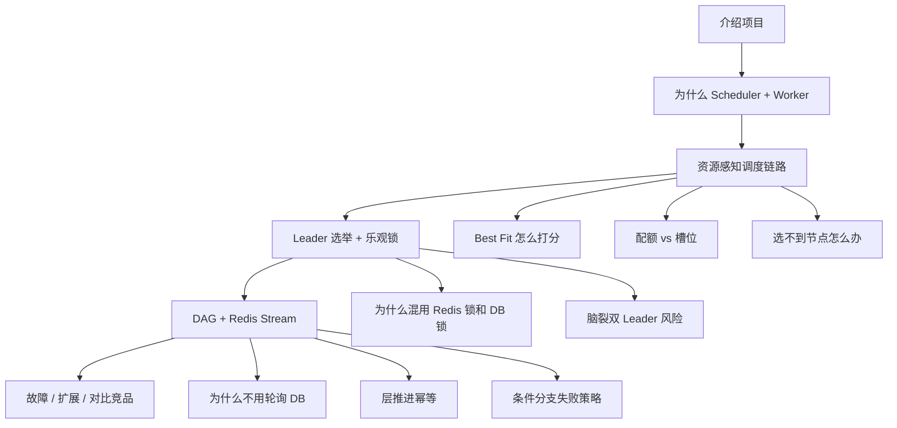

**系统设计向的面试，很少问「这个功能你怎么写的」，更常问「你为什么这样拆、边界在哪、失败了怎么办、量上来怎么改」。** 对你这个项目，面试官通常会从你简历上的 bullet 出发，往「架构决策 → 权衡 → 故障 → 演进」四个层次挖。

下面按**问法模式**整理，并附上**他们想听到的设计思维**。

---

## 一、面试官真正在考什么

| 表面在问 | 实际在考 |
|----------|----------|
| 「介绍一下你的项目」 | 能否用 30 秒讲清**问题域 + 核心架构 + 关键设计决策** |
| 「为什么拆 Scheduler / Worker？」 | 是否理解**控制面 / 执行面**分离，而不是随便分包 |
| 「DAG 和调度器为什么分开？」 | 有没有**单一职责**意识，能否避免上帝类 |
| 「为什么用 Redis Stream？」 | 是否做过**方案对比**，知道 trade-off |
| 「多实例怎么保证不重复调度？」 | 分布式**一致性边界**是否清楚 |
| 「如果 QPS 涨 10 倍怎么办？」 | 有没有**演进路径**，不是只会写当前代码 |
| 「和 XXL-Job / Airflow 比呢？」 | 是否理解**产品定位**，知道刻意不做什么 |

**功能实现型回答：**「我用了 Redisson 加锁，然后 scheduleLoop 扫 PENDING 任务……」

**系统设计型回答：**「调度是多实例无状态的，但扫库调度必须互斥，所以在调度循环外层加 Leader 选举；单任务维度还有任务锁 + DB 乐观锁，因为 Leader 锁只管『谁扫』，不管『扫到同一任务怎么办』。」

差别在于：后者有**问题 → 约束 → 方案 → 代价**。

---

## 二、最可能遇到的 6 类系统设计问法

### 1. 「从零设计」类 —— 考察问题抽象能力

> 「假如让你设计一个支持 DAG、资源限制、多租户的轻量调度系统，你会怎么拆模块？」

**追问链：**
- 核心实体有哪些？（Task / TaskInstance / Workflow / ResourceNode / Quota）
- 状态存在哪？为什么 MySQL 做 source of truth，Redis 做什么？
- 谁负责「任务该跑」vs「任务在哪跑」vs「任务怎么跑」？

**你要展示的设计点：** 三层分离 —— DAG 编排 / 调度决策 / 任务执行。这正是你项目文档里的核心原则：

```
DAG 引擎：拓扑、顺序、下一批
调度器：配额、选点、预留、PENDING→RUNNING
执行器：运行、监控、回调
```

**加分回答：** 主动说「如果 DAG 引擎也管资源，每次加调度策略都要改工作流代码，所以把资源决策下沉到 Scheduler。」

---

### 2. 「职责边界」类 —— 考察分层是否合理

> 「任务完成后，谁决定工作流下一层什么时候提交？」

**追问链：**
- 为什么不用定时扫 DB 看上游是否都 SUCCESS？
- Redis Stream 在这里扮演什么角色？换成 Kafka 行不行？
- 如果 Consumer 挂了，事件丢了吗？

**设计思维要点：**
- **编排层**只关心依赖是否满足，不应轮询 DB（延迟高、DB 压力大）
- **事件驱动**解耦「任务终态」和「工作流推进」
- 要承认 trade-off：Stream 带来**至少一次投递**，所以层推进需要**幂等**（你文档里第 19 题就是典型深挖点）

---

### 3. 「一致性边界」类 —— 分布式系统最爱考

> 「部署 3 个 Scheduler，怎么保证同一个任务不会被调度两次？」

**追问链：**
- Leader 锁和任务锁分别防什么？
- 为什么还需要 MySQL 乐观锁？
- Leader GC 停顿 / 网络分区时会发生什么？
- dispatch 失败回滚了，Worker 其实已经收到请求怎么办？（幽灵执行）

**设计思维要点：** 面试官想听你能画三层防线：

```
Leader 锁 → 同一时刻只有一个实例跑 scheduleLoop
任务锁   → 同一 taskInstance 不会被两个周期同时处理
乐观锁   → 状态 CAS，防止 PENDING→RUNNING 被覆盖
```

**诚实加分：** 主动提 `项目未来完善方向.md` 里已知问题，比如 dispatch 回滚与 Worker 已执行的**不一致窗口**，以及你会怎么检测修复 —— 这比假装完美可信得多。

---

### 4. 「资源模型」类 —— 区分「排任务」和「管资源」

> 「你的资源感知调度和普通优先级队列有什么本质区别？」

**追问链：**
- Quota、Slot、Usage 三者关系？
- Best Fit 选不到节点时任务挂 PENDING 还是直接 FAILED？
- 租户 A 占满配额，租户 B 的任务会怎样？公平吗？
- 节点心跳丢失，上面 RUNNING 的任务怎么处理？

**设计思维要点：**
- 传统调度器：**任务队列 + 选 Worker**
- 你的系统：**任务队列 + 配额账本 + 节点容量 + 槽位预留**，是两套状态机
- 要能说清**不变量**：`已预留 ≤ 节点可用容量`，`租户已用 ≤ 配额上限`

这类题考的是：你有没有把「调度」当成**资源分配问题**，而不只是「取一条记录发出去」。

---

### 5. 「故障与语义」类 —— 考察生产意识

> 「Worker 回调迟到了，任务已经被标记 TIMEOUT，会发生什么？」

> 「提交削峰用的是内存队列，实例重启会怎样？」

> 「Remote 模式下 HTTP 下发成功但 Scheduler 没收到 ACK，你怎么处理？」

**设计思维要点：**
- 先定义语义：**至少一次 / 至多一次 / 恰好一次**，你的系统更接近哪种
- 再说**幂等键**、**终态不可变**、**迟到回调丢弃/忽略**的策略
- 最后说**补偿**：人工 rerun、对账任务、状态审计日志

面试官不是在考你有没有完美实现，而是考：**失败路径你有没有设计过**。

---

### 6. 「演进与扩展」类 —— 考察架构视野

> 「现在单体 Scheduler，用户量上来后你怎么拆？」

> 「为什么不用 K8s CronJob / Airflow，非要自己做？」

> 「Fair Scheduling、任务抢占如果要加，你会改哪一层？」

**设计思维要点：**
- 拆分边界：API 服务 / 调度器进程 / 工作流编排 / Worker 池
- 定位差异：轻量、资源感知、多租户 —— **不是 K8s 替代品**
- 未实现的高级调度（Fair / Backfill / Preemption）应说：**设计并调研过，会加在 Scheduler 策略层，不动 DAG 引擎**

---

## 三、结合你简历 4～5 条 bullet 的「追问地图」

你简历如果写的是之前那版，面试官大概率沿这条线挖：



**建议只深挖 3 条主线**，其余点到为止：
1. 资源感知调度（你的差异化）
2. 多实例一致性（Leader + 乐观锁）
3. DAG 事件驱动（职责分离）

JWT、OpenAPI、AOP 权限 —— 被问到再答，不要主动展开。

---

## 四、系统设计题的标准答法（2～3 分钟模板）

每个问题按 **5 步** 答，面试官会觉得你在做设计而不是背代码：

1. **澄清需求/约束**  
   「单机还是多实例？要不要 DAG？资源要不要隔离？」

2. **核心实体与状态**  
   「TaskInstance 是调度最小单元，状态 PENDING→RUNNING→终态，MySQL 持久化。」

3. **模块划分与数据流**  
   「提交 → 削峰队列 → DB → 调度循环 → 预留 → 下发 → 回调 → Stream 推进 DAG。」

4. **关键设计决策 + 为什么**  
   「Leader 选举因为扫库调度不能并行；Stream 因为编排不应轮询 DB。」

5. **失败场景 + 已知不足 + 演进**  
   「内存队列重启会丢，生产可换 Redis Stream；Fair 调度未做，会加在策略层。」

---

## 五、高频「系统设计」原题（比功能题更像大厂风格）

下面这 10 道，比「某个类怎么写」更像真实系统设计面试：

1. **设计一个支持 DAG 的分布式任务调度系统，说明模块划分和数据流。**
2. **为什么控制面和执行面要分离？分离后一致性怎么保证？**
3. **多 Scheduler 实例下，如何避免重复调度和资源重复预留？**
4. **任务提交流量突增 1000 QPS，你会怎么保护数据库？**
5. **工作流 100 个节点，层内并行 20 个，你如何推进下一层？轮询还是事件？**
6. **ResourceAware 和 Priority 两种策略，架构上如何做到可插拔？**
7. **Worker 节点宕机，其上 RUNNING 任务如何发现、标记、重调度？**
8. **租户配额耗尽时，是排队还是拒绝？对 SLA 有什么影响？**
9. **如果让你从 MySQL 扫表调度改成消息驱动调度，你会改哪些边界？**
10. **对比 Airflow：你的系统刻意简化了什么？为什么？**

你 `docs/针对项目的面试题.md` 里 1、3、6、8、11、14、17、18、19、23 题，基本就是上面这 10 道的「带源码细节版」。

---

## 六、怎么准备才像「注重系统设计的人」

**1. 准备一张口述架构图（60 秒版）**  
API → SubmitQueue → DB(PENDING) → SchedulerLoop(Leader) → Quota/Slot → Dispatch → Worker → Callback → Redis Stream → DAG 下一层

**2. 准备 3 个「设计决策故事」**  
每个故事格式：**当时的问题 → 备选方案 → 为什么选这个 → 代价是什么**

例如 Leader 选举：
- 问题：多实例重复扫库
- 备选：DB 悲观锁 / ZooKeeper / Redis 锁
- 选择：Redisson Watchdog，因为已有 Redis、实现轻
- 代价：Redis 故障时调度停摆，需监控 + 降级策略

**3. 主动暴露 1～2 个已知设计债**  
例如内存削峰队列非分布式安全、dispatch 回滚与幽灵执行 —— 并说出改进方向。  
**这比吹「完美实现」更能体现设计成熟度。**

**4. 区分「已实现」和「设计并调研」**  
Fair / Backfill / Gateway / Web UI 不要说成已上线。

---

## 七、一句话总结

大厂系统设计面试，对你这个项目的核心期待是：

> **你能说清楚：谁负责什么、状态存哪、一致性保到哪一层、失败了怎么办、量大了怎么拆 —— 而不是罗列用了哪些 Spring/Redis 组件。**

如果你愿意，我可以下一步按你简历最终版，帮你写 **3 个「设计决策故事」的完整口述稿**（每个 2 分钟，可直接背），或者从 `针对项目的面试题.md` 里挑 **6、10、14、19** 这四道最容易被系统设计深挖的题，给出参考答案要点。