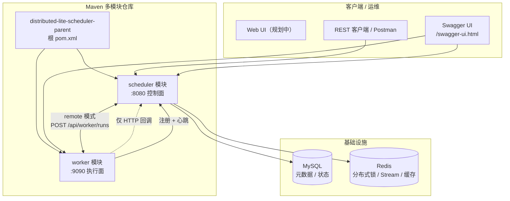
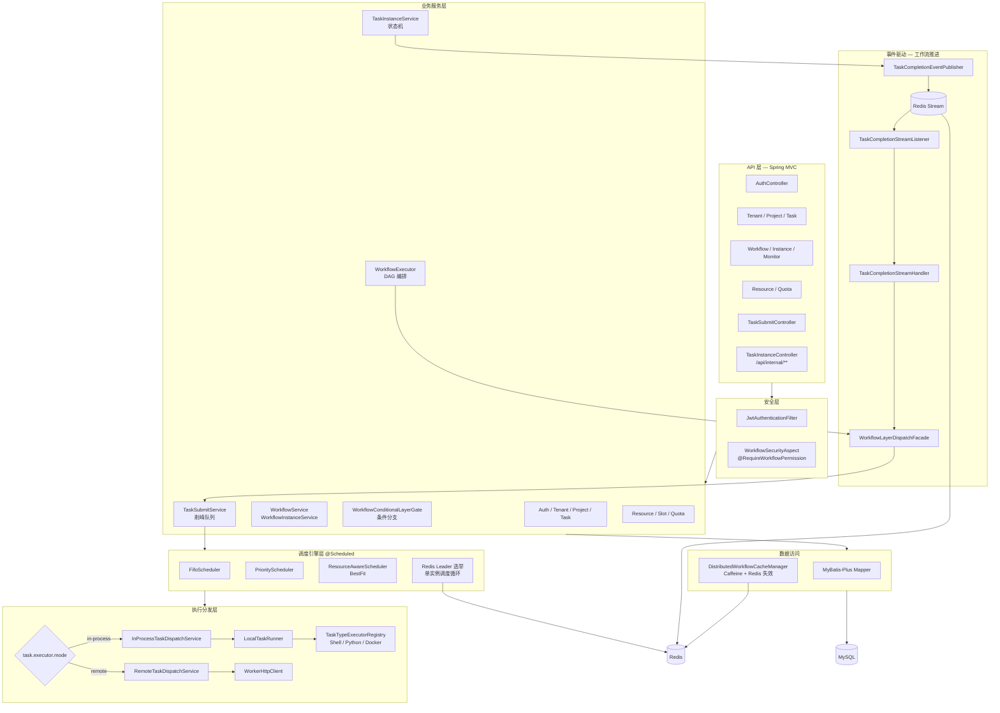
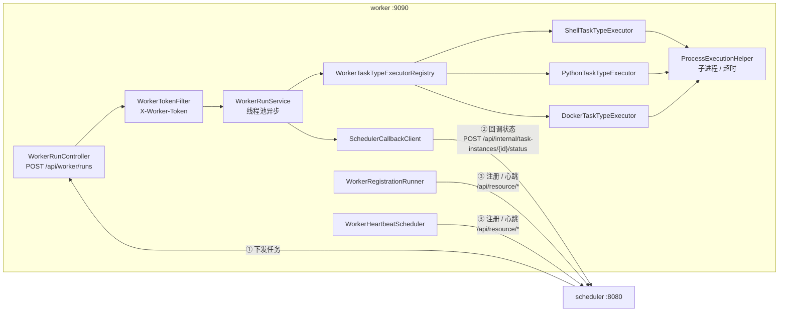
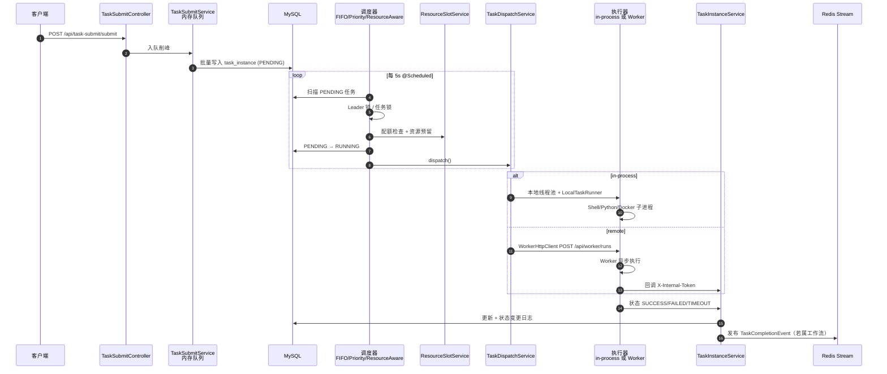
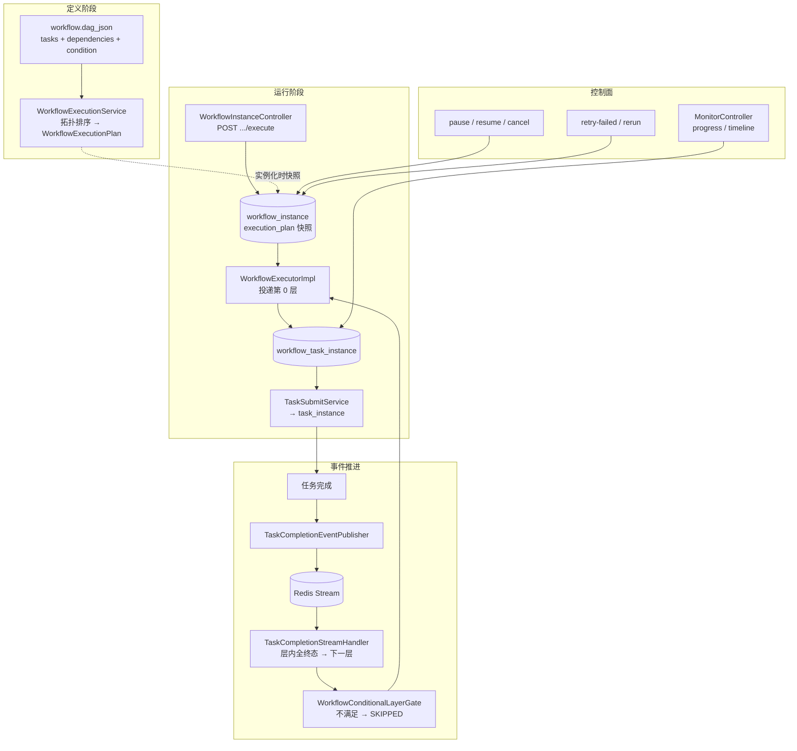
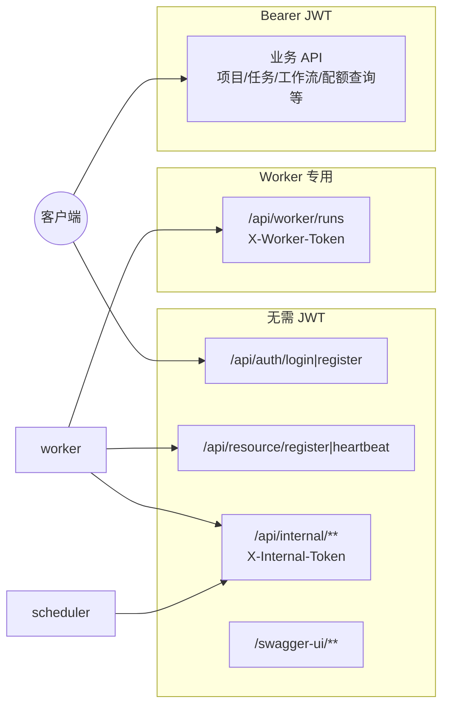
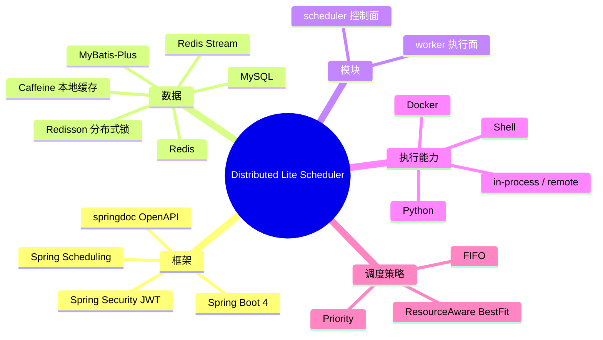

下面用多张互补的图描述 **Distributed Lite Scheduler V1** 的总体架构（基于当前 `scheduler` + `worker` 多模块实现）。

---

## 1. 部署与模块总览

| 组件 | 端口 | 职责 |
|------|------|------|
| **scheduler** | 8080 | 认证、租户、任务/工作流、调度决策、状态机 |
| **worker** | 9090 | 接收下发、执行 Shell/Python/Docker、回调结果 |
| **MySQL** | 3306 | 持久化实体与实例状态 |
| **Redis** | 6379 | Leader 锁、任务锁、工作流完成事件 Stream、工作流缓存 |

---

## 2. 调度中心（scheduler）内部分层

**设计要点：**

- **DAG 引擎**只负责「哪一层、哪些节点该提交」，不直接管 CPU/选点。
- **调度器**负责 PENDING→RUNNING、配额、选节点、资源预留。
- **执行器**负责真正跑任务（本机或远程 Worker）。
- **工作流下一层**不靠轮询，靠 **Redis Stream** 上的任务完成事件驱动。

---

## 3. 远程 Worker 模块结构

---

## 4. 单任务生命周期（核心数据流）

---

## 5. DAG 工作流编排（与单任务的关系）

---

## 6. 安全与鉴权边界

---

## 7. 技术栈一览

---

## 8. 架构一句话总结

> **scheduler** 是「大脑」：存元数据、编排 DAG、选资源、改状态、推事件；**worker** 是「手脚」：在独立进程里跑任务并回调；**MySQL** 记事实，**Redis** 管并发与异步推进；**in-process** 适合开发，**remote** 适合水平扩展。

---

若你需要 **导出为 PNG/SVG**（用于论文或答辩），可以说一下偏好工具（draw.io / PlantUML / Mermaid Live），我可以按其中一种格式再整理一版「单页大图」的节点清单。若希望把「三套调度器同时运行」标成已知风险，也可以在图里加注释层。